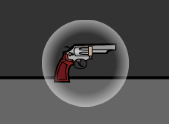

# Advanced-Language-Programming


### 如何安装

安装git

首先用cocos2d-x新建一个项目


删除掉不需要的文件，留下这两个文件（`.cocos-project.json`不知道要不要用到，先留着）


在这个路径下打开`git Bash`  输入指令  `git clone https://github.com/Randonee1/Advanced-Language-Programming.git` 将远端仓库中的内容下载到本地，会生成 `Advanced-Language-Programming` 文件夹，里面的文件都被 `git`  管理


将 `Advanced-Language-Programming` 中的  `cmake.txt`  (cmake 指令如果时vs2019要改一下)和  `CMakeLists.txt` 文件复制到项目文件路径下


在项目文件 `proj.win32`  路径下进入 `cmd` ，输入 `cmake` 指令，指令在仓库中的 `cmake.txt` 文件中，生成解决方案 `sln`


然后程序就可以跑了


### Git 版本管理

pass


### 如何添加文件

在 `Classes` 对应的路径下新建文件，重新在 `proj.win32` 下`cmake`  一遍（直接进入 `cmd` 输入 `cmake`  指令，不需要删除其他文件），在进入  `sln`  文件中就可以看见对应目录下新添加的文件

如果直接在解决方案文件里面直接添加文件，会发现新建的文件会在 `proj.win32` 目录下，这是因为在解决方案对应的文件都以虚文件的方式被管理，同时 `Classes`  文件夹不在 `proj.win32`  文件夹目录下，所以也不能切换到真实目录添加文件。


## 游戏文档/项目进程


### 人物身体组件organ

为实现人物复杂的动画我将人物分解成不同的组件：头、身体、手、脚、脸。不同的身体组件对应不同的响应动画，并且都继承于 `OrganBase`  类，`OrganBase` 基类中包括 `init()` 函数用于初始化组件;`setFlippedX()`  函数用于翻转组件（Cocos中的翻转函数只支持图片像素上的翻转不支持图片坐标的翻转）；`MoveDelay()` 函数用于动画的延迟（用于跳跃动作）

  

### UI界面设计
### **11.20 实现开机动画、start界面。实现了目录的鼠标move监听。**


添加菜单项个数的鼠标move监听，在每个监听里设置回调函数。回调函数通过添加精灵，设置淡出效果，设置0.5f的延时，从而实现目录的鼠标move效果。

相当于整个目录分为了两层，一层是menu的菜单项，另一层是三个精灵，由鼠标事件触发调用。

提升点：可以使用透明度更高的图片，效果会更好

### **11.21 对菜单栏的滑条进行优化。**
通过设置精灵的action代替0.5f的淡出效果，实现“鼠标菜单某位置，某位置即做出滑条反应，并稳定出现滑条”，不再出现在设置淡出效果时，若鼠标长时间不动就淡出，在视觉上造成闪退的问题。
### **12.12 start界面背景换为两个AI在sunset的场景。**


实现：将双AI打斗的场景涉及的部分放到底层，在他的上层加菜单栏。

存在问题：直接在init()里切换场景，因为时间过短，handleSceneChange()捕捉不到场景的改变，所以会出现黑屏的情况。引擎源码如下：
```
init()
// do something
handleSceneChange()
```
问题解决：在init()中调用切换场景函数时，添加delay进行延迟，目前在我电脑上，delay最快为1.05f(不同电脑会不同，设为2.0f比较保险)  
delay设置代码如下：
```
auto* delay = DelayTime::create(2.0f);
auto* func = CallFunc::create([this]() {
    // 切换场景
});
this->runAction(Sequence::create(delay, func, nullptr));
```

仍存在问题：切换后会有一段时间的灰屏出现，目前合理推断为程序执行捕捉场景变化函数时的状态，若要解决，可能需要改引擎。  

### **12.15 实现Setting界面。且完成背景音乐和音效的控制。**

  
有关背景音乐和音效的控制：在Helloworld类中预加载；在StartScene类内初始化背景音乐；在Setting类内实现对背景音乐的控制。

存在问题：在StartScene类中，如果如下初始化，会导致每回一次StartScene，就叠加一个从头播放的背景音乐，最后导致多层背景音乐叠加。
```
auto backgroundAudioID = AudioEngine::play2d("Music/Start.mp3", true);
```
问题解决：通过isBackgroundMusicPlaying()函数来确认是否目前有音乐，若有，直接stop。这样的效果是每回一次StartScene,都从头播放音乐。
```
if (!instance->isBackgroundMusicPlaying()){}
	else {
		instance->stopBackgroundMusic(); //stop后无法恢复播放
	}
	instance->playBackgroundMusic("Music/Start.mp3", true);
```

### **12.17 实现BackgroundChoise界面。在GameManager类添加全局变量**

该界面主要是按钮构成。地图选择的部分添加滑动色块的效果。但以图片按钮存在第一个问题就是，点击后会迅速恢复原状态，所以在回调函数中，更改主状态图片；第二个问题是，两张图片位于同一图层，这样在最后选中时，橙色位于滑动色块下层，效果不好，所以在点击回调函数中设置图层变更。

该界面还有一个文本框，用于输入需要的生命数量。

该界面的所有选择信息，都存入GameManager里，为后续游戏准备。
### UI界面设计
### **11.20 实现开机动画、start界面。实现了目录的鼠标move监听。**


添加菜单项个数的鼠标move监听，在每个监听里设置回调函数。回调函数通过添加精灵，设置淡出效果，设置0.5f的延时，从而实现目录的鼠标move效果。

相当于整个目录分为了两层，一层是menu的菜单项，另一层是三个精灵，由鼠标事件触发调用。

提升点：可以使用透明度更高的图片，效果会更好

### **11.21 对菜单栏的滑条进行优化。**
通过设置精灵的action代替0.5f的淡出效果，实现“鼠标菜单某位置，某位置即做出滑条反应，并稳定出现滑条”，不再出现在设置淡出效果时，若鼠标长时间不动就淡出，在视觉上造成闪退的问题。
### **12.12 start界面背景换为两个AI在sunset的场景。**


实现：将双AI打斗的场景涉及的部分放到底层，在他的上层加菜单栏。

存在问题：直接在init()里切换场景，因为时间过短，handleSceneChange()捕捉不到场景的改变，所以会出现黑屏的情况。引擎源码如下：
```
init()
// do something
handleSceneChange()
```
问题解决：在init()中调用切换场景函数时，添加delay进行延迟，目前在我电脑上，delay最快为1.05f(不同电脑会不同，设为2.0f比较保险)  
delay设置代码如下：
```
auto* delay = DelayTime::create(2.0f);
auto* func = CallFunc::create([this]() {
    // 切换场景
});
this->runAction(Sequence::create(delay, func, nullptr));
```

仍存在问题：切换后会有一段时间的灰屏出现，目前合理推断为程序执行捕捉场景变化函数时的状态，若要解决，可能需要改引擎。  

### **12.15 实现Setting界面。且完成背景音乐和音效的控制。**

  
有关背景音乐和音效的控制：在Helloworld类中预加载；在StartScene类内初始化背景音乐；在Setting类内实现对背景音乐的控制。

存在问题：在StartScene类中，如果如下初始化，会导致每回一次StartScene，就叠加一个从头播放的背景音乐，最后导致多层背景音乐叠加。
```
auto backgroundAudioID = AudioEngine::play2d("Music/Start.mp3", true);
```
问题解决：通过isBackgroundMusicPlaying()函数来确认是否目前有音乐，若有，直接stop。这样的效果是每回一次StartScene,都从头播放音乐。
```
if (!instance->isBackgroundMusicPlaying()){}
	else {
		instance->stopBackgroundMusic(); //stop后无法恢复播放
	}
	instance->playBackgroundMusic("Music/Start.mp3", true);
```

### **12.17 实现BackgroundChoise界面。在GameManager类添加全局变量**

该界面主要是按钮构成。地图选择的部分添加滑动色块的效果。但以图片按钮存在第一个问题就是，点击后会迅速恢复原状态，所以在回调函数中，更改主状态图片；第二个问题是，两张图片位于同一图层，这样在最后选中时，橙色位于滑动色块下层，效果不好，所以在点击回调函数中设置图层变更。

该界面还有一个文本框，用于输入需要的生命数量。

该界面的所有选择信息，都存入GameManager里，为后续游戏准备。

### **1.4 实现PlayerSetup类**
里面按钮都关联全局变量的设置。  

### **1.6 实现排行榜**
排行榜主要是文件读写的部分。同时需要实现一个按map的value[0]排序的算法。  
再就是一些小点。比如说控制小数位数保留，double值转string。


### 人物动画制作


### 11/14

蔡政特：我把游戏引擎改了，可以实现较为流畅的动作。目前实现了人物的左右移动，跳跃动作，开枪动作，子弹弹壳的关联动画（按o或者1开枪）


* Cocos2d 引擎修改

  引擎痛点：引擎中自带的action只能实现固定的轨迹，再动作执行过程中无法改变对象的相对位置（比如再游戏过程中需要翻转，对应的动作不会跟着翻转）

  修改方案：在动作更新时，根据对象是否翻转情况，改变对象的坐标。以 ` MoveBy()` 举例，原引擎是在动作开始时先得到对象当前的坐标值，然后在每次更新时，计算相对于开始坐标的移动距离，更新对象的位置，问题在于 `MoveBy()` 


### 11/17

实现人物不同floor之间移动：

首先确定每个floor的边界，将所有floor的左右边界放入到  `vector<vector<float>>Floor`  中，每个floor的高度由于不同floor之间的高度是一定的，所以我们只用记录第一层floor的高度和每一层之间的高度差。

人物在不同floor之间移动的基本逻辑是,人物“跳跃‘时 `floor++`  ，人物”下降“时 `floor--`，人物”踩空“时`floor--` , 人物下降在边界外时 `floor--`，这样我们就能确定每一时刻人物对应的floor。

我们可以根据floor计算出该floor对应的高度，利用floor的高度和边界值可以得到人物的”落点区域“，当人物在空中处在下降状态时并且高度下降到floor对应的高度时，若在该floor对应的边界内时人物”落地“，若不在人物继续下降。


### 11/19

镜头的跟随和多层画布相对移动：

我是将人物作为子节点放到platform上，所以实现镜头的移动则为平台以和人物相反的方向移动，达到镜头跟随的效果，但是如果平台移动距离和人物移动距离完全一致就会出现人物完全静止的效果，所以平台实际移动的距离为人物移动距离乘上一个相对系数，后面的画布逻辑一样，移动方向为人物移动方向的反方向，同时移动距离为人物移动距离乘上一个相对系数，由近到远，系数逐渐减少趋近0。


上图为多图层叠加缩小看之后的效果


### 11/20

子弹制作

子弹的创建我放在了枪shot动作中

弹壳制作

子弹碰撞事件


### 11/21

血迹制作


### 11/22

换枪动作


### 11/24

枪械切换（扔枪，捡枪）

枪械的切换会出现在两个环节中，一个是在捡到一把枪的时候，一个是在捡到的枪子弹用完切换回手枪的时候。一开始的思路就是直接替换人物里面的 `gun` 对象，但是发现没有那么简单。由于种种原因我首先是在人物类里面定义了一个枪对象，再将这个对象传到 `hand1` （拿枪的那只手）里面，这就导致我要换一把枪就要考虑到将这两个对象都进行修改，不过好在我的hand类里面有个一` GetGun()` 函数可以直接替换滚对象。第二个问题是，虽然我替换了 `gun` 对象但是我担心实际绘制到画面上的枪还是之前的枪或者直接报错，但是结果是我多虑了， `cocos2dx` 里面是可以替换子节点对象的，只需要先将之前的枪 `remove` 掉先然后再对 `gun` 赋值。解决了可以替换的问题，问题来到如何替换，我的解决思路是直接再人物类里面写一个替换枪的函数 `GunChange()` ，传入的参数是目标替换枪，因为是直接传入一个new出来的全新的枪，所以新枪要“继承”旧枪的一些属性，这样就完成了换枪操作。

说一下遇到的坑，一是因为要换回到手枪，所以我一开始在人物里面定义了一个 `initGun` 对象存储一开始的枪，然后 `init` 的时候给这个 `initGun` 赋值，之后如果要换枪的时候直接换回这个枪就可以了，但是后面发现不能直接赋值（因为直接赋值，赋过去的是一个指针），所以我在枪类里面写了一个 `clone` 函数，生成一个和原枪类型一样的对象，但即使这些操作都没有问题，我发现后面还是报错，原来是 `cocos2dx` 默认的 `create` 函数会让对象自动释放，如果一开始给 `initGun` 赋值放到人物类里面如果不把这把枪“用”起来（画在下一帧的画面上），系统就会自动释放 `initGun` 里面的内容


### 11/26

GunPackage/SkillPackage

因为游戏中需要人物去捡包来更换枪械和技能，所以创建了 `GunPackage` 和 `SkillPackage` 两个类，这两个类都继承于 `PackageBase` 类，每个子类都一个 `updatetime` 的静态变量，记录包的更新时间。 `PackageBase ` 继承于 `Sprite` 类，里面几个重要函数： `init()` 用于初始化包， `GetPackage(CharacterBase*) ` 用于相应人物捡到包的事件， `update()` 更新包的位置。

 `GunPackage` 类中 `GetPackage(CharacterBase*)` 较为简单，只需要调用人物的 `GunChange(GunChange *)` 并传入 `GunPackage` 中存放的要替换的枪就可以了。



 `SkillPackage` 类中 `GetPackage(CharacterBase*)` 本来也想现在 `SkillPackage` 中先初始化一个 `skill` 对象，再将 `skill` 传入到人物里，但是这样会出现一个情况就是当人物捡到包之后，该包会直接被delete掉，这样包中对应的skill也会跟着一起被delete掉， `GunPackage` 不会出现这种情况是因为，传入的枪并不是 `GunPackage` 中的枪本身而是该枪的克隆  `gun->clone()`  （这个函数是之前写换枪动作的时候写的）。所以 `SkillPackage` 的初始化不能直接先初始化一个 `skill` 对象，而是先用一个东西记录要传递的技能，再在 `GetPackage` 时初始化这个技能。


PackageEvent

一开始的时候我想直接在MapBase里创建一个PackageBase*类型的vector，然后在类似于Map中的ShotEvent()检测人物与包的碰撞事件，但是不能直接将 vector<PackageBase *>直接放入到MapBase中，因为我们在PackageBase.h文件中包含了MapBase.h，但要将vector<PackageBase *>放入到MapBase中需要包含PackageBase.h，这样会出现递归包含（后面发现有好的解决办法，就是在其中一个头文件中只声明另外一个头文件中包含的类，在对应的cpp文件中包含头文件）。解决办法是不要直接在MapBase中直接声明vector<PackageBase *>而是在每个子类地图中分别声明这个vector。但是每个package都是需要单独初始化，这样就又要改每个map中的update函数，还要存放各种时间来更新地图中的包，这样程序的可读性就不高，也不利于package事件的维护。

PackageEvent的作用就是来解决这个问题的。一方面可以解决MapBase和PackageBase之间的递归包含的问题，另一方面也可以独立的维护package事件。PackageEvent中有update()函数用于更新地图中的包，PackageUpdate函数可以用于响应人物与包的碰撞事件。

### 11/28

skill

人物技能的逻辑是，在技能持续时间内改变人物的一些属性（人物的属性包括最大的速度，加速度等，都存放在status这个结构体里面），在技能持续时间结束后恢复这些改变过的属性。我们只用在每个skill的构造函数中先保存人物的原始属性，然后改变人物相应的属性，最后在析构函数里恢复人物的属性。同时为了添加技能对应的特效，所以就需要一个update()，实时更新相应的特效。

### 12/1

SpeedUp：快速位移


这个技能除了能加快人物的移动速度和加速度之外的一大亮点就是残影的特效。我用一个链表结构来存储每个残影

```c++
struct Shadow {
	Sprite* figure;
	Vec2 point;
	Shadow* next;
	Shadow* last;
	
	Shadow(Sprite* figure,Vec2 point, Shadow* last) {
		this->figure = figure;
		this->point = point;
		this->last = last;
		this->next = nullptr;
	}
};
```

其中的每一个残影存储了位置信息和相应的图像，并存有指向上一个残影的指针和指向下一个残影的指针。首先设置残影的最大数量和更新时间，并用 `head` 和 `tail` 分别存储残影列表的头尾指针。每一次更新，先将 `head` 指针指向的残影绘制到画布上，然后创建一个新的指针，并传入当前人物的位置和对应的图像，同时移动 `head` 指针的位置。如果残影的数量达到最大值，还需要释放 `tail` 指针，对应的残影也会从画布上被移除，最后将 `tail` 指针前移。

有一点需要特别注意，就是每次创建指针不能直接传入当前人物对应的指针，一是该指针会发生变化，残影的内容得不到记录，二是后面对残影的操作会关联到人物上去，会出现各种错误，所以我的做法是在 `CharacterBase` 类中定义一个 `clone()` 函数该函数根据人物的各个部件的实时的状态返回一个新的图像。

