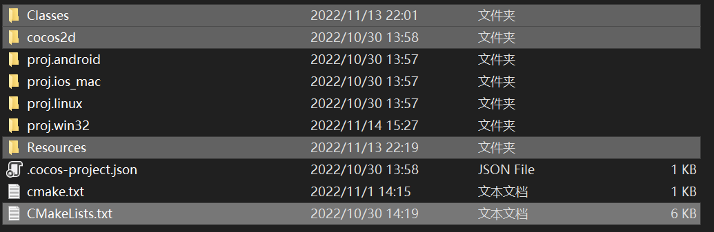

# Advanced-Language-Programming

### 如何安装

首先新建一个项目，在cocos2d-x引擎路径下新建一个项目

从远程仓库中拉取文件： `Classes` `cocos2d`  `Resources` `CmakeLists.txt` 替换掉新建项目中对应的文件

在项目文件 `proj.win32` 目录下进入 `cmd` ，输入 `cmake` 指令，指令在仓库中的 `cmake.txt` 文件中，生成解决方案 `sln`

### 如何添加文件

在 `Classes` 对应的路径下新建文件，重新在 `proj.win32` 下`cmake`  一遍（直接进入 `cmd` 输入 `cmake`  指令，不需要删除其他文件），在进入  `sln`  文件中就可以看见对应目录下新添加的文件

如果直接在解决方案文件里面直接添加文件，会发现新建的文件会在 `proj.win32` 目录下，这是因为在解决方案对应的文件都以虚文件的方式被管理，同时 `Classes`  文件夹不在 `proj.win32`  文件夹目录下，所以也不能切换到真实目录添加文件。

### 11/14

蔡政特：我把游戏引擎改了

* Cocos2d 引擎修改

  引擎痛点：引擎中自带的action只能实现固定的轨迹，再动作执行过程中无法改变对象的相对位置（比如再游戏过程中需要翻转，对应的动作不会跟着翻转）

  修改方案：在动作更新时，根据对象是否翻转情况，改变对象的坐标。以 ` MoveBy()` 举例，原引擎是在动作开始时先得到对象当前的坐标值，然后在每次更新时，计算相对于开始坐标的移动距离，更新对象的位置，问题在于 `MoveBy()` 

