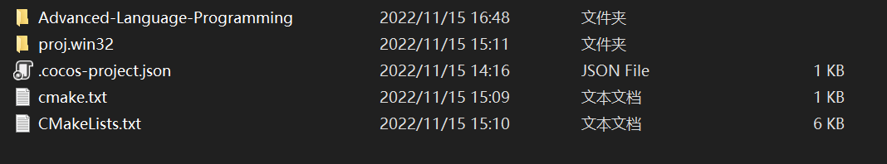
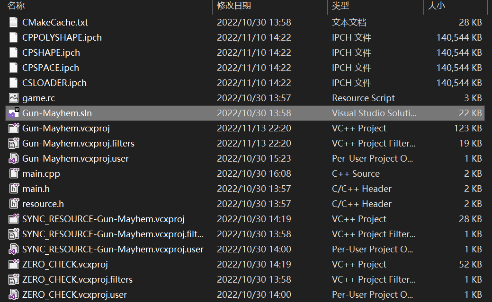
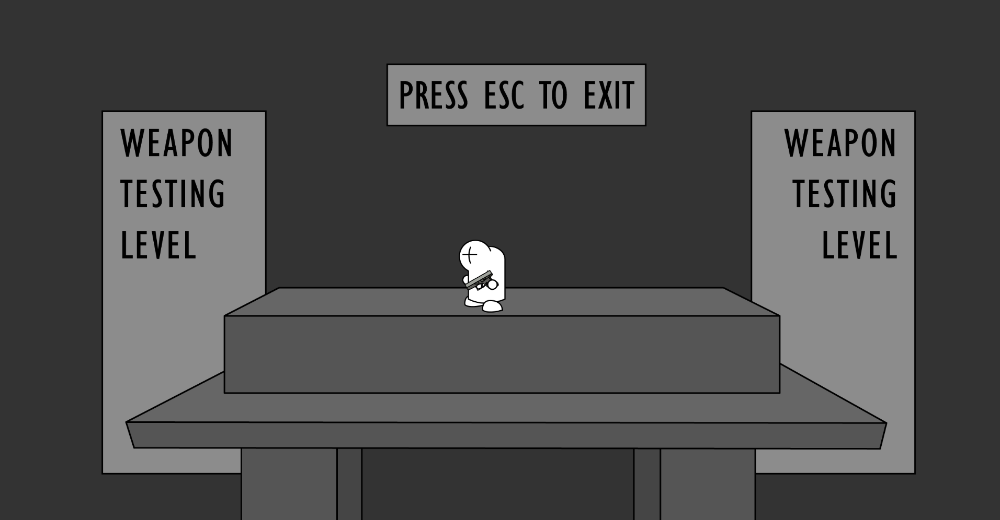

# Advanced-Language-Programming

### 如何安装

安装git

首先用cocos2d-x新建一个项目

删除掉不需要的文件，留下这两个文件（`.cocos-project.json`不知道要不要用到，先留着）

在这个路径下打开`git Bash`  输入指令  `git clone https://github.com/Randonee1/Advanced-Language-Programming.git` 将远端仓库中的内容下载到本地，会生成 `Advanced-Language-Programming` 文件夹，里面的文件都被 `git`  管理

将 `Advanced-Language-Programming` 中的  `cmake.txt`  (cmake 指令如果时vs2019要改一下)和  `CMakeLists.txt` 文件复制到项目文件路径下

在项目文件 `proj.win32`  路径下进入 `cmd` ，输入 `cmake` 指令，指令在仓库中的 `cmake.txt` 文件中，生成解决方案 `sln`

然后程序就可以跑了

### Git 版本管理

pass

### 如何添加文件

在 `Classes` 对应的路径下新建文件，重新在 `proj.win32` 下`cmake`  一遍（直接进入 `cmd` 输入 `cmake`  指令，不需要删除其他文件），在进入  `sln`  文件中就可以看见对应目录下新添加的文件

如果直接在解决方案文件里面直接添加文件，会发现新建的文件会在 `proj.win32` 目录下，这是因为在解决方案对应的文件都以虚文件的方式被管理，同时 `Classes`  文件夹不在 `proj.win32`  文件夹目录下，所以也不能切换到真实目录添加文件。

## 游戏文档/项目进程

### 人物身体组件organ

为实现人物复杂的动画我将人物分解成不同的组件：头、身体、手、脚、脸。不同的身体组件对应不同的响应动画，并且都继承于 `OrganBase`  类，`OrganBase` 基类中包括 `init()` 函数用于初始化组件;`setFlippedX()`  函数用于翻转组件（Cocos中的翻转函数只支持图片像素上的翻转不支持图片坐标的翻转）；`MoveDelay()` 函数用于动画的延迟（用于跳跃动作）

### 人物动画制作

### 11/14

蔡政特：我把游戏引擎改了，可以实现较为流畅的动作。目前实现了人物的左右移动，跳跃动作，开枪动作，子弹弹壳的关联动画（按o或者1开枪）

* Cocos2d 引擎修改

  引擎痛点：引擎中自带的action只能实现固定的轨迹，再动作执行过程中无法改变对象的相对位置（比如再游戏过程中需要翻转，对应的动作不会跟着翻转）

  修改方案：在动作更新时，根据对象是否翻转情况，改变对象的坐标。以 ` MoveBy()` 举例，原引擎是在动作开始时先得到对象当前的坐标值，然后在每次更新时，计算相对于开始坐标的移动距离，更新对象的位置，问题在于 `MoveBy()` 

### 11/17

实现人物不同floor之间移动：

首先确定每个floor的边界，将所有floor的左右边界放入到  `vector<vector<float>>Floor`  中，每个floor的高度由于不同floor之间的高度是一定的，所以我们只用记录第一层floor的高度和每一层之间的高度差。

人物在不同floor之间移动的基本逻辑是,人物“跳跃‘时 `floor++`  ，人物”下降“时 `floor--`，人物”踩空“时`floor--` , 人物下降在边界外时 `floor--`，这样我们就能确定每一时刻人物对应的floor。

我们可以根据floor计算出该floor对应的高度，利用floor的高度和边界值可以得到人物的”落点区域“，当人物在空中处在下降状态时并且高度下降到floor对应的高度时，若在该floor对应的边界内时人物”落地“，若不在人物继续下降。

### 11/19

镜头的跟随和多层画布相对移动：

我是将人物作为子节点放到platform上，所以实现镜头的移动则为平台以和人物相反的方向移动，达到镜头跟随的效果，但是如果平台移动距离和人物移动距离完全一致就会出现人物完全静止的效果，所以平台实际移动的距离为人物移动距离乘上一个相对系数，后面的画布逻辑一样，移动方向为人物移动方向的反方向，同时移动距离为人物移动距离乘上一个相对系数，由近到远，系数逐渐减少趋近0。

上图为多图层叠加缩小看之后的效果

### 11/20

血迹制作

### 11/21

AI的初步想法

### 11/22

换枪动作

### 11/24

枪械切换（扔枪，捡枪）

枪械的切换会出现在两个环节中，一个是在捡到一把枪的时候，一个是在捡到的枪子弹用完切换回手枪的时候。一开始的思路就是直接替换人物里面的 `gun` 对象，但是发现没有那么简单。由于种种原因我首先是在人物类里面定义了一个枪对象，再将这个对象传到 `hand1` （拿枪的那只手）里面，这就导致我要换一把枪就要考虑到将这两个对象都进行修改，不过好在我的hand类里面有个一` GetGun()` 函数可以直接替换滚对象。第二个问题是，虽然我替换了 `gun` 对象但是我担心实际绘制到画面上的枪还是之前的枪或者直接报错，但是结果是我多虑了， `cocos2dx` 里面是可以替换子节点对象的，只需要先将之前的枪 `remove` 掉先然后再对 `gun` 赋值。解决了可以替换的问题，问题来到如何替换，我的解决思路是直接再人物类里面写一个替换枪的函数 `GunChange()` ，传入的参数是目标替换枪，因为是直接传入一个new出来的全新的枪，所以新枪要“继承”旧枪的一些属性，这样就完成了换枪操作。

说一下遇到的坑，一是因为要换回到手枪，所以我一开始在人物里面定义了一个 `initGun` 对象存储一开始的枪，然后 `init` 的时候给这个 `initGun` 赋值，之后如果要换枪的时候直接换回这个枪就可以了，但是后面发现不能直接赋值（因为直接赋值，赋过去的是一个指针），所以我在枪类里面写了一个 `clone` 函数，生成一个和原枪类型一样的对象，但即使这些操作都没有问题，我发现后面还是报错，原来是 `cocos2dx` 默认的 `create` 函数会让对象自动释放，如果一开始给 `initGun` 赋值放到人物类里面如果不把这把枪“用”起来（画在下一帧的画面上），系统就会自动释放 `initGun` 里面的内容

### 11/26

PackageEvent

