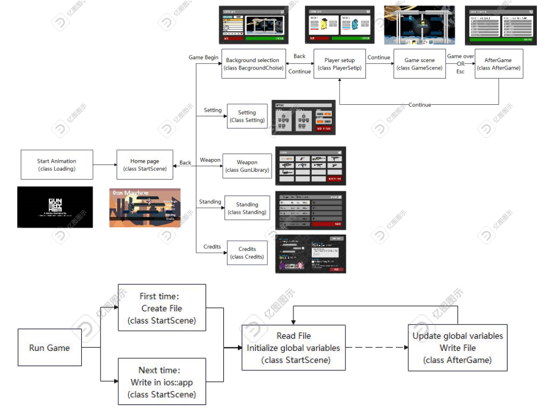

# Gun-Mayhem-master
## Runtime Environment
|environment|Version|
|---|---|
|Visual Studio |Both VS2019 and VS2022 are available|
|Cocos-2dx|4.0|
|Windows|Windows 10, Windows 11|
## General Design

## Function
* Game start interface, background music, volume control, pause and resume function, exit
  function
* Create rooms and enter rooms, support for adding AI
* Weapon system, at least the realization of pistol, sniper rifle, machine gun three different
  weapons and special weapons explosive kit. Different weapons have different effects.
* Weapon drop feature, you can get different weapons by picking up dropped treasure chests
* Keyboard to realize the character walk and jump, the mouse to achieve gun attack and explosives
  attack
* Infinite life
* Special effects for attacks and explosions
* Timing system
* Critical strike and hit display
* Scoring and leaderboards

## Detailed Design

See [doc/Design](https://github.com/Randonee1/Advanced-Language-Programming/blob/main/doc/Design.md)

## Setup

See [doc/Setup](https://github.com/Randonee1/Advanced-Language-Programming/blob/main/doc/Setup.md)

## Developer

|Name|School|Major|Work|
|---|---|---|---|
|蔡政特|华南理工大学|数据科学与大数据技术|Framework establishment, base class design, map derivatives design, firearm derivatives design, character movement design, shooting logic design, character body components creation, character skills creation, package system design, firearm animation design|
|张皓泉|华南理工大学|数据科学与大数据技术|Character art design, gun art design, map art design, sound effect production|
|全秦霄|华南理工大学|数据科学与大数据技术|UI interfaces design, game music management realization, game information data management realization|
|李伟杰|华南理工大学|数据科学与大数据技术|Game AI base class and its derivatives, game scene design, Package class design ， program test|