## Character body components

In order to achieve complex animation of characters, this project decomposes characters into different components: head, body, hands, feet, face. Different body components correspond to different response animations, and they all inherit from the `OrganBase` class. The `OrganBase` base class includes the image corresponding to the sprite “organ” storage component, the `init()` function which is used to initialize the component, and the `setFlippedX()` function which is used to flip the component (Cocos The flip function only supports flipping on image pixels but not on image coordinates); the `MoveDelay()` function is used for animation delay (the face, hands, and feet have certain delay effects during the jumping process). The following is the structure of the `OrganBase` class

```c++
class OrganBase : public Sprite
{
public:

	bool initWithName(const char* name);

	virtual void setFlippedX(bool flippedX);

	virtual void MoveDelay(bool up, bool floor);

	int lastDelayTag;

	Sprite* organ;
};
```

In the class `Hand` and `Feet`, the `Walk()` function is used for the walking animation of the hands and feet during the movement process (hand swinging arms back and forth, feet stepping back and forth)

In the `Hand` class, `RaiseHandToShot()` is used for the response of the character when shooting, including hand animation and weapon events. This project defines the hand animation in the `weapon` class, because different weapons use different hand animations. `Shot()` function corresponds to weapon events including weapon animations and other responses. Functions with similar functions include `BulletChangeWithHand()` and `DelayWithHand()`, one is used to actively change the gun after the bullet is used up, and the other is used to passively change the gun after picking up the weapon. The following is the definition of `RaiseHandToShot()` function.

```c++
void Hand::RaiseHandToShoot(MapBase* map,bool right)
{
    onShot = false;
    actionState = false;
    organ->stopAllActions();
    CallFunc* onshot = CallFunc::create(CC_CALLBACK_0(Hand::SetShot, this));
    auto raise = Gun->RaiseHand(right);
    auto seq_shot = Sequence::create(onshot, raise, onshot, nullptr);
    organ->runAction(seq_shot);
    if(this->gun)
        this->Gun->Shot(map, right);
}
```


## Composition of body components

Each body component is also a sprite in essence, but the image corresponding to the component is stored in the class member `organ`, and the component itself does not have any image, so the combination of body components needs to consider the coordinate position of each component object and the relative coordinate position of the organ in the component. The reason why the image of the body component is not directly defined on the component itself, but as a member variable in it , is that this transforms the original one-layer image into two-layer, one is the component sprite space, and the other is the organ sprite , the two-layer image is more flexible and convenient in the realization of subsequent character actions.

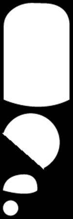

<center style="font-size:18px;color:#C0C0C0;text-decoration:underline">Figure: Body components (body, head, hands, feet)</center> 


## `setFlippedX()`: Flip function

The Flip function is one of the most critical functions in the entire game. The flip function in the original engine only supports "flip" at the pixel level, but the character is composed of a great many components, and there is a relative positional relation, so it needs to be considered to flip the component on the coordinate plane. The most basic `setFlippedX()` function is as shown in the figure below , where the variable _flippedX is used to record the flipping state of the sprite. Different components also need to consider other elements that need to be flipped, such as the displacement of the organ relative to the component object, the rotation angle of the organ, and so on .

```c++
void OrganBase::setFlippedX(bool flippedX)
{
    organ->setFlippedX(flippedX);// organ flip
    if (_flippedX != flippedX)
    {
        _flippedX = flippedX;
        this->setPositionX(-this->getPositionX());// position filp
        flipX();
    }
}
```


## Design of control buttons

The response events of the keyboard in the original game engine are only at the moment of pressing a key and at the moment of bouncing a key, but to determine whether a key is pressed or not, a map is needed to store the state of the key. In this way, the character only needs to judge the movement of the character according to the value in the map. The following figure shows the key map.

```c++
std::map<std::string, EventKeyboard::KeyCode> GameManager::map1 = {
    {"up", EventKeyboard::KeyCode::KEY_UP_ARROW},
    {"down", EventKeyboard::KeyCode::KEY_DOWN_ARROW},
    {"left", EventKeyboard::KeyCode::KEY_LEFT_ARROW},
    {"right", EventKeyboard::KeyCode::KEY_RIGHT_ARROW},
    {"shot", EventKeyboard::KeyCode::KEY_1 },
    {"skill", EventKeyboard::KeyCode::KEY_2 }
};
```


## The realization of left-right movement/jump/double jump

The basic logic of character movement and jumping is to change the movement speed of the character. `update()` function changes the position of the character according to the instantaneous speed of the character, and at the same time updates the character's attributes and actions. The following code only includes the movement logic of the character on the flat ground, and does not consider the action update during the movement of the character and the movement and shooting logic of the character between the floors (see the source code for the detailed logic).

```c++
void CharacterBase::update(float dt)// simple version
{
	Sprite::update(dt);
    // if not in the air
    if (!inTheAir) {
        y_speed = 0;
        isDoubleJump = false;
        // common jump
		if (keyMap["up"]) {
            inTheAir = true;
            y_speed = status->y_maxSepped;
            keyMap["up"] = false;
        }
    }
    // if in the air
    if (inTheAir) {
        //跳起暂停走路动作
        if (!isDoubleJump && keyMap["up"]) {
            y_speed = status->y_maxSpeed / 1.2;
            isDoubleJump = true;
            keyMap["up"] = false;
        }
    }
    // drop
    if (y_speed < 0)
    {
        if (getPositionY() > floor_base && getPositionY() + y_speed * dt <floor_base) {
            keyMap["down"] = false;
            inTheAir = false;
            y_speed = 0;
            // update position
            this->setPositionY(map->floor_base + floor * map->floor_height);
        }
        else {
            this->setPositionY(getPositionY() + y_speed * dt);
        }
    }
    // update position
    else
        this->setPositionY(getPositionY() + y_speed * dt);
    // left and right movement
    if ((keyMap["left"] ^ keyMap["right"])) {

        if (keyMap["left"])
            Flip(true);
        else
            Flip(false);
        accelerate = keyMap["right"] ? status->acceleration : -status->acceleration;
        x_speed += accelerate * dt;
        if (x_speed * accelerate > 0 && std::abs(x_speed) > status->x_maxSpeed )
            x_speed -= accelerate * dt;
    }
    // decelerate
    else if(! inTheAir) {
        accelerate = x_speed > 0 ? -status->resistance : status->resistance;
        if (std::abs(accelerate * dt) > std::abs(x_speed))
            x_speed = 0;
        else
            x_speed += accelerate * dt;
    }
}
```

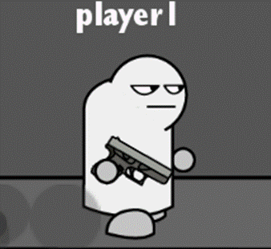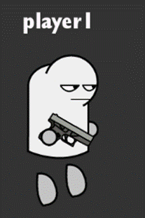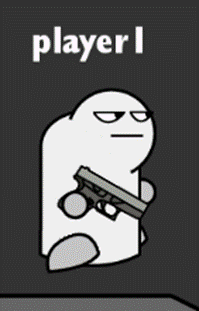

<center style="font-size:18px;color:#C0C0C0;text-decoration:underline">Figure: Three states of character movement (right, jump, fall)</center> 


## `Cocos2d` engine modification

Engine pain point: The built-in action in the engine can only achieve a fixed trajectory, and the relative position of the object cannot be changed during the execution of the action (for example, if it needs to be flipped during the game, the corresponding action will not be flipped). The reason is that the logic of the animation movement of the original engine is to first record the initial state of the action object at the beginning of the action , and then calculate the required change amount (distance or angle) according to the action, and then update the state of the object (position) based on these two values. and angle), the problem is that the initial state and the change amount do not change during the execution of the action . During the action cycle , the object will change according to the planned route, and will not change according to the actual flip situation.

Modification scheme: When the action is updated, change the initial state and change amount of the object according to whether the object is flipped or not. Take `MoveBy::create(float t,Vec2 x)` as an example (t is the action period, x is the offset coordinate), the original engine first obtains the initial coordinate value of the object at the beginning of the action, and then at each update, Calculate the offset at this moment in the action cycle according to the total offset of the action, and finally update the position of the object. What needs to be modified is the initial coordinate value and offset in this action. According to the flipping of the action object, the initial coordinate value and corresponding offset of the action can be changed in real time.

```c++
void MoveBy::update(float t)
{
    if (_target)
    {
        Vec2 currentPos = _target->getPosition();
        Vec2 diff = currentPos - _previousPosition;// offset
        _startPosition = _startPosition + diff;
        Vec2 Delta = _positionDelta;
        _target->isLeft() ? Delta.x = -_positionDelta.x : Delta.x = _positionDelta.x;// change the offset
        Vec2 start = _startPosition;// initial position
        _target->isLeft() ^ isLeft ? start.x = -_startPosition.x : start.x = _startPosition.x;// change the offset coordinates
        Vec2 newPos = start + (Delta * t);// update position
        _target->setPosition3D(newPos);
        _previousPosition = newPos;
    }
}
```


## Movement of characters on the floor

If the floor gets a certain collision volume, you need to define its rigid body properties at the physical level, but this will greatly limit the movement space of the character, so the character cannot flexibly shuttle between different floors. Therefore, the game writes the movable range of each map into an array. During the movement of the character, use the function `InTheBoundary()` to determine whether the character is in the boundary of map according to the position of the character. This project puts the left and right borders of all floors into vector “Floor”, the height difference between each floor is fixed, and only the height of the first floor needs to be recorded in the map , using the height difference and layer Number to calculate the height of other floors .

```c++
bool CharacterBase::InTheBoundary(std::vector<float>& floor, float x) const
{
    for (int i = 0; i < floor.size() - 1; i += 2) {
        if (x > floor[i] && x < floor[i + 1])
            return true;
    }
    return false;
}
```


## The realization of the character moving between different floors

The basic logic for moving characters between floors is “floor++” when the character "jumps", “floo--" when the character "falls", “floor--" when the character "steps in the air", and when the character falls outside the boundary “floor--", so that the floor corresponding to the character can be determined at each moment.

But if you encounter a situation where the character does not jump up the steps, you need to judge that the character is in the process of descending. If the character passes through the layer (not within the boundary of the layer), then “floor--", there is also a character "stepping on the air" " and "falling" use the double jump to jump back, these two cases will make “floor--", but the number of floors cannot be increased directly after the double jump, but after the double jump Whether to wear the upper layer floor, if it is worn, it will be “floor++”, if not, it will remain unchanged. The game uses the relationship between the position of the character and the floors and the movement state of the character to determine the floor the character is on.

The subsequent AI movement judgment will use the floor value of the character, but if the above floor game is directly used, it is not easy to directly judge the floor of the character, because when the character jumps, the character “floor++”, but the actual number of floors has not changed . Therefore, floor_actual is introduced in the game to further judge the number of floors the characters are in. Floor_actual is only updated once after the characters land, so that the floor of the characters will not be changed immediately when the characters jump and fall, which is more conducive to the logical judgment of AI.

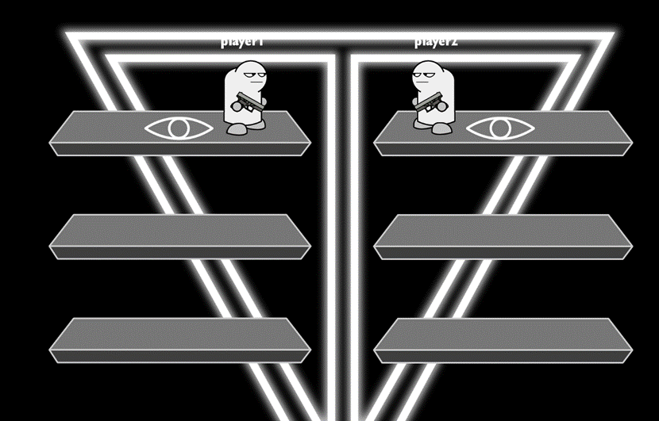

<center style="font-size:18px;color:#C0C0C0;text-decoration:underline">Figure: Both player and AI are on the top floor</center> 


## Camera follow and relative movement of multi-layer canvas

This project is to put the character as a child node on the platform, so the camera moves in the opposite direction to the platform and the character to achieve the following effect, but if the platform moving distance and the character moving distance exactly the same will lead to the phenomenon of the character finished relatively stationary, so the actual moving distance of the platform is the moving distance of the character multiplied by a relative coefficient. The logic of the following canvas is the same, the moving direction is the opposite direction of the moving direction of the character, and the moving distance is the moving distance of the character multiplied by a relative coefficient. From near to far, the coefficient gradually decreases and approaches 0.

```c++
backLayer->setPosition(initbackLayerPosition - delta * 0.1);
mountain1->setPosition(initMountain1Position - delta * 0.2);
city1->setPosition(initCity1Position - delta * 0.3);
city2->setPosition(initCity2Position - delta * 0.4);
city3->setPosition(initCity3Position - delta * 0.5);
mountain2->setPosition(initMountain2Position - delta * 0.6);
platform->setPosition(initPlatformPosition - delta * 0.7);
```

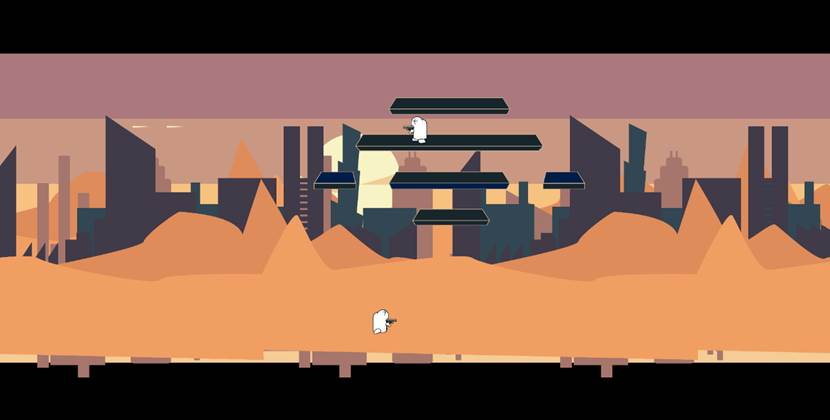

<center style="font-size:18px;color:#C0C0C0;text-decoration:underline">Figure: Overlay of multiple layers of canvas</center> 


## Manufacture of bullets and shell casings

The creation of the bullet is located in the animation of the firearm. The animation of the firearm is composed of a series of basic animations. This game engine allows a function to be spliced between a series of animations as an action. You only need to create bullets in a function, and embed this function in a series of animations of the gun.

```c++
CallFunc* onshot = CallFunc::create(CC_CALLBACK_0(GunBase::SetShot, this));
CallFunc* shot = CallFunc::create(CC_CALLBACK_0(GunBase::SetBullet, this));
CallFunc* onfire = CallFunc::create([&]() {fire = !fire; });
auto aim = RotateTo::create(0, 0);
auto up = RotateTo::create(0.05, -30);
auto down = RotateTo::create(0.05, 0);
auto delay = RotateTo::create(0.9, 0);
auto back = RotateTo::create(0.3, 30);
auto seq_shot = Sequence::create(onshot,onfire, aim, shot, up, down,onfire, delay, back, onshot, nullptr);
gun_right->runAction(seq_shot);
```

When creating a bullet, it is necessary to pass in the position of the bullet when it is fired and the pointer of the shooter itself. The pointer of the shooter stores the pointer of the weapon it carries, and the weapon stores the rate of fire and damage of the bullet. In this way, each bullet is After shooting, it has different attributes. At the same time, it can also respond to the shooter after hitting the opponent, realizing the interaction between the shooter and the bullet. At the same time, the game can also derive other throwing weapons through bullets, such as baseballs, knives, bombs, etc.

```c++
void Gun_Glock::SetBullet()
{
    GunBase::SetBullet();
    BulletCase::create(map->platform, GetPositionToBackground(true), Vec2(10, 30), this->_flippedX,400,800);
    map->bullets.push_back(Bullet::create(player, GetPositionToBackground(true), Vec2(50, 30)));
}
```

shell creation is similar to bullets, but there is no need to realize the interaction between the shell and the character. In order to reflect the randomness of the shell when it falls, the initial speed and rotation speed of the shell are random.


## Bullet collision event

The bullet collision event does not use the physics engine. The program judges the bullet collision event based on whether the bullet's rectangle overlaps with the character's rectangle. After the bullet is created, it is added to the dynamic array of bullets in the map class. When the map is updated, judge the collision between the bullet and the character. If the collision occurs, update the state of the person hit according to the attributes of the bullet.

```c++
void MapBase::ShotEvent()// simple version
{
	for (auto& bullet : bullets) {
        
		for (auto& player : players) {
            
			auto rect = player->body->organ->getBoundingBox();// calculate the player rectangle area
			Vec2 offset = player->getPosition() + player->body->getPosition();
			rect.origin += offset;// calculate the position of the rectangle
            
			if (rect.containsPoint(bullet->getPosition()) && 
                player->valid && bullet->player != nullptr) {

					player->x_speed += player->defense ? 
                        bullet->hitSpeed / 10 : bullet->hitSpeed;// hit Person Knockback Speed
					// bloodstain production
					if(!player->defense) {
						auto blood = Blood::create();
						blood->setPosition(bullet->getPosition());
						platform->addChild(blood, 4);
					}

					bullet->removeFromParent();
					bullet = nullptr;
					break;
				}
			}
		}
	}
}
```


## Production of particle animation:

The particle animations in this game include: blood, dust, jetpack flames, etc. This project does not use traditional particle animation production software to produce particle animations, but uses random functions and animations to produce particle animation. The following function `Random ()` returns a random value for the input range:

```c++
float GameManager::Random(int min, int max) {
    std::random_device rd;
    std::default_random_engine eng(rd());
    std::uniform_real_distribution<float> distr(min, max);
    return distr(eng);
}
```

The dust animation divides the animation into three parts: move left and right, move_up float up, and shrink disappear. The distance of the float and float, and the time of disappearance are all random, which creates a dusty feeling.

```c++
bool Dust::init()
{
	if (!Sprite::init())
		return false;

	for (int i = 0; i< 5;i++)
		Dusts.push_back(Sprite::create("dust.png"));

	for (auto& dust : Dusts) {
		float x = rand() % 2 - 1 < 0 ? GameManager::Random(0,200) : -(GameManager::Random(0, 200));
		float y = GameManager::Random(-30, 150);
		float time = GameManager::Random(6, 16) / 10.0f;
		auto move = EaseSineOut::create(MoveBy::create(time, Vec2(x, 0)));
		auto move_up = MoveBy::create(time, Vec2(0, y));
		auto shrink = ScaleBy::create(time, 0);
		auto Dissipate = CallFunc::create([&]() {dissipate++; });
		auto spa = Spawn::create(move,move_up, shrink, nullptr);
		auto seq = Sequence::create(spa, Dissipate, nullptr);
		dust->setScale(GameManager::Random(3, 7)/2.0f);
		dust->setOpacity(GameManager::Random(60, 150));
		dust->setPosition(x/3, 0);
		this->addChild(dust);
		dust->runAction(seq);
	}
	return true;
}
```


## Action of changing gun /throwing gun

All firearms need to be followed by a gun-changing action after the bullets are exhausted, so as to make the switching of weapons look smooth. The game plan is to throw the gun out after the bullets are exhausted, and then replace it with the gun to be switched. The logic of changing the gun is to replace the member variable gun in the character with the gun to be switched after the bullets are used up. But the problem is where in the program should the gun-changing animation be executed. If the basic logic is to give the gun an animation of being thrown out after the bullets are exhausted, but when the bullets are exhausted, it will immediately switch to another gun. Release to the pointer of the previous gun at the same time, so that the pointer has been released before the animation of the previous gun being thrown is executed, and the animation will also be released along with it, so that no gun will be thrown out. Effect. So the plan of this project is to pass the image of this gun to the next gun before the previous gun is thrown out, so that the previous gun is thrown before the animation of the next gun is executed. The effect of going out, which solves the problem that the previous gun has been released before being thrown. `BulletChangeWithHand()` function contains the animation of the character's hand and the animation of the gun after the gun is changed .

```c++
 if (gun->bulletCount >= gun->bulletClip && gun->deltatime > gun->shotInterval) {
    throwGun = gun->clone();// previous gun image
    GunChange(initGun);// change gun
    hand1->BulletChangeWithHand(throwGun, true);
    hand2->BulletChangeWithHand(throwGun, false);
}
```

```c++
void Hand::BulletChangeWithHand(GunBase* throwgun,bool right)
{
    onShot = false;
    organ->stopAllActions();
    CallFunc* onchange = CallFunc::create([&]() {onShot = !onShot; });
    auto bulletchange = throwgun->BulletChange(right);
    auto seq_change = Sequence::create(onchange,bulletchange,onchange, nullptr);
    organ->runAction(seq_change);

    this->Gun->Change(throwgun, right);
}
```


## Pick-up gun action

The action of the character picking up the gun is simpler than the action of the character throwing the gun. The basic logic is to replace the original gun of the character with the picked gun. However, the problem encountered is that if the last gun is still executing the animation Picking up a gun, the action of the character's hand still stays in the posture of the previous gun, and if the posture of the character's hand is not in the initialized state, there will be bugs when executing the action of the next gun , so for a coherent connection For the animation of picking up the gun, `DelayWithHand()` is defined in the `Hand` class to switch between picking up the gun . If the last gun is in the aiming posture, the posture of the hand and the gun after picking up the gun will first maintain the aiming posture Put it down again, so that your movements can be coherent and smooth.

```c++
void Hand::DelayWithHand(bool right)
{
    onShot = false;
    organ->stopAllActions();
    CallFunc* onshot = CallFunc::create(CC_CALLBACK_0(Hand::SetShot, this));
    auto raise = Gun->HoldingOn(right);
    auto seq_shot = Sequence::create(onshot, raise, onshot, nullptr);
    organ->runAction(seq_shot);
    if (this->gun)
        this->Gun->Delay(right);
}
```


## `GunPackage`/`SkillPackage`

Both `GunPackage` and `SkillPackage` are inherited from `PackageBase` class, and each subclass has a static variable of updatetime, which records the update time of the package. `PackageBase` is inherited from the `Sprite` class, and there are several important functions in it: `init()` is used to initialize the package; `GetPackage(CharacterBase*)` is used for the event that the corresponding character picks up the package; `update()` updates the package location .

`GetPackage(CharacterBase*)` in the `GunPackage` class is relatively simple, you only need to call `GunChange(GunChange *)` of the character and pass in the gun to be replaced stored in `GunPackage`.

```c++
void GunPackage::GetPackage(CharacterBase* player)
{
    player->GunChange(gun->clone());
}
```

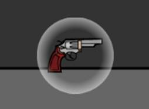

<center style="font-size:18px;color:#C0C0C0;text-decoration:underline">Figure: gun bag (revolver)</center> 

The original idea of `GetPackage(CharacterBase*)` in the `SkillPackage` class is to first initialize a skill object in `SkillPackage`, and then pass skill into the character, but there will be a situation where the character After picking up the package, the pointer corresponding to the package will be released directly, so that the corresponding skill in the package will also be released together. `GunPackage` will not have this situation because the incoming gun is not `GunPackage`. The gun itself is the clone of the gun (this function was written when the gun change action was written before). Therefore, the initialization of `SkillPackage` cannot directly initialize a skill object first, but first use the enumeration class `SkillType` to record the skill to be transferred, and then initialize the skill when get package.


<center style="font-size:18px;color:#C0C0C0;text-decoration:underline">Figure: Skill pack (clone, extra life, jetpack, defense, acceleration, super jump, random)</center> 


## Package Event

All package events are encapsulated in the `PackageEvent` class. You only need to call its initialization function at the beginning of the game and call its update function during the game update process. Using these two interface functions can better manage package events.

```c++
class PackageEvent
{
public:
	
	static PackageEvent* create(MapBase* map);

	bool init(MapBase* map);// init

	void PackageUpdate(std::vector<CharacterBase*>&players);//pick or not

	void update(float dt);// update package drop position

	float gunUpdateTime;// gun package refresh time

	float skillUpdateTime;// skill package refresh time

	MapBase* map;

	std::vector<PackageBase*> packages;// package list
};
```


## Skills

The logic of character skills is to change some attributes of the character during the duration of the skill (the attributes of the character include maximum speed, acceleration, etc., which are stored in the status structure), and restore these changed attributes after the skill duration ends. The three most critical functions of the `Skill` class are constructor, destructor and update function. In the constructor, the program changes the attributes of the character such as displacement speed, acceleration, and blood volume according to specific skills, and restores the original attributes of the character in the destructor. The `update()` function updates the status of the character according to the skill characteristics, and updates the corresponding special effects at the same time. The logical judgment of the skill is placed at the end of the `update()` function of the `CharacterBase` class. The purpose of this is that the update changes made by the skill will not be overwritten by the original logical judgment of the character class.

```c++
if (!skills.empty()) {
    for(auto& skill: skills) {
        if (skill->skillEnd) {
            delete skill;
            skill = nullptr;
        }
        else {
            skill->update(dt);
        }
    }
    for (auto it = skills.begin(); it != skills.end();) {
        if (*it == nullptr) it = skills.erase(it);
        else it++;
    }
}
```

##### Skill1: `SpeedUp`

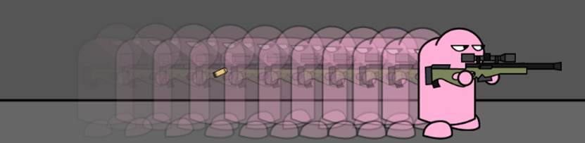

<center style="font-size:18px;color:#C0C0C0;text-decoration:underline">Figure: afterimage</center> 

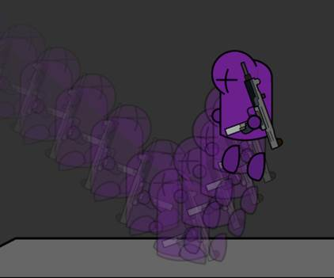

<center style="font-size:18px;color:#C0C0C0;text-decoration:underline">Figure: afterimage</center> 

In addition to speeding up the character's movement speed and acceleration, one of the highlights of this skill is the afterimage special effect. The specific method is to use a linked list structure to store each afterimage

```c++
struct Shadow {
	Sprite* figure;
	Vec2 point;
	Shadow* next;
	Shadow* last;
	
	Shadow(Sprite* figure,Vec2 point, Shadow* last) {
		this->figure = figure;
		this->point = point;
		this->last = last;
		this->next = nullptr;
	}
};
```

Each of the afterimage stores position information and a corresponding image, and stores a pointer to a previous afterimage and a pointer to a next afterimage. First set the maximum number of afterimages and update time, and use “head” and “tail” to store the head and tail pointers of the afterimage list respectively. For each update, first draw the afterimage pointed by the “head” pointer to the canvas, then create a new pointer, and pass in the current position of the character and the corresponding image, and move the position of the “head” pointer. If the number of afterimages reaches the maximum value, the “tail” pointer needs to be released, and the corresponding afterimages will also be removed from the canvas, and finally the “tail” pointer will be moved forward.

One thing that needs special attention is that every time you create a pointer, you cannot directly pass in the pointer corresponding to the current character. First, the pointer will change, and the content of the afterimage will not be recorded. Second, the direct operation on the afterimage pointer will affect the character itself (if the pointer of the character itself is passed in), there will be various errors, so the method in the project is to define a `clone()` function in the `CharacterBase` class. This function is based on the real-time Status returns a new image.

##### Skill2: `Jetpack`

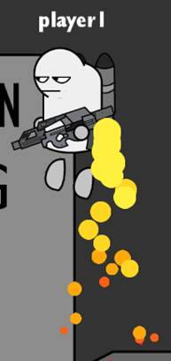

<center style="font-size:18px;color:#C0C0C0;text-decoration:underline">Figure: Jetpack</center> 

The basic logic of the jetpack is to change the longitudinal acceleration of the character in the `update()` function, so that the character can fly upwards by pressing the up button while jumping in the air, and at the same time create a jet particle animation during the leap to realize the character jet upward special effects.

```c++
void Jetpack::update(float dt)
{
	SkillBase::update(dt);

	if (player->getPositionY() > player->map->platform->getContentSize().height + 1000) flyable = false;
	if (player->getPositionY() < player->map->platform->getContentSize().height + 500) flyable = true;

	if (player->keyMap["up"] == true && player->inTheAir && player->isDoubleJump  && flyable) {
		if (onAction)
			player->MoveDelay(true, false);
		onAction = false;
		player->status->gravitation = anti_gravitation;
		if (player->y_speed > player->status->y_maxSpeed/1.2)
			player->y_speed -= player->status->gravitation * dt;

		Emission();
	}
	else {
		player->status->gravitation = gravitation;
		onAction = true;
	}

	if (jetpack->isFlippedX() != player->isFlippedX()) {
		jetpack->setFlippedX(player->isFlippedX());
		jetpack->setPositionX(-jetpack->getPositionX());
	}
}
```

##### Skill3: `DoubleTeam`

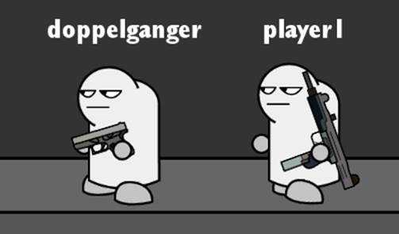

<center style="font-size:18px;color:#C0C0C0;text-decoration:underline">Figure: avatar</center> 


The basic logic of the split is when creating an AI in the constructor of the skill, and the initial position of the AI is created in the same position as the character, but after creating it, some parameters of the split have to be adjusted accordingly.

```c++
DoubleTeam::DoubleTeam(CharacterBase* player)
{
	skillTpye = DOUBLE_TEAM;
	this->player = player;
	duration = 0;
	Duration = 10;
	doppelganger = AI2::create(player->getTag(), player->map);
	doppelganger->isDoppelganger = true;
	doppelganger->firstLand = false;
	doppelganger->playerName->setString("doppelganger");
	doppelganger->Live = 1;
	doppelganger->isDoubleJump = player->isDoubleJump;
	doppelganger->inTheAir = player->inTheAir;
	doppelganger->floor = player->floor;
	doppelganger->floor_actual = player->floor_actual;
	if (!doppelganger->skills.empty()) {
		for (auto& skill : doppelganger->skills) {
			delete skill;
			skill = nullptr;
		}
		doppelganger->skills.clear();
	}
	doppelganger->Flip(player->isFlippedX());
	doppelganger->GetOpponent(player->opponent);
	doppelganger->setPosition(player->getPosition());
	player->map->platform->addChild(doppelganger);
}
```

 