### UI界面设计

### **11.20 实现开机动画、start界面。实现了目录的鼠标move监听。**

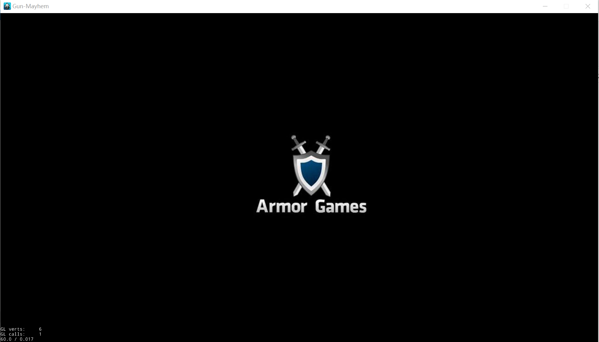
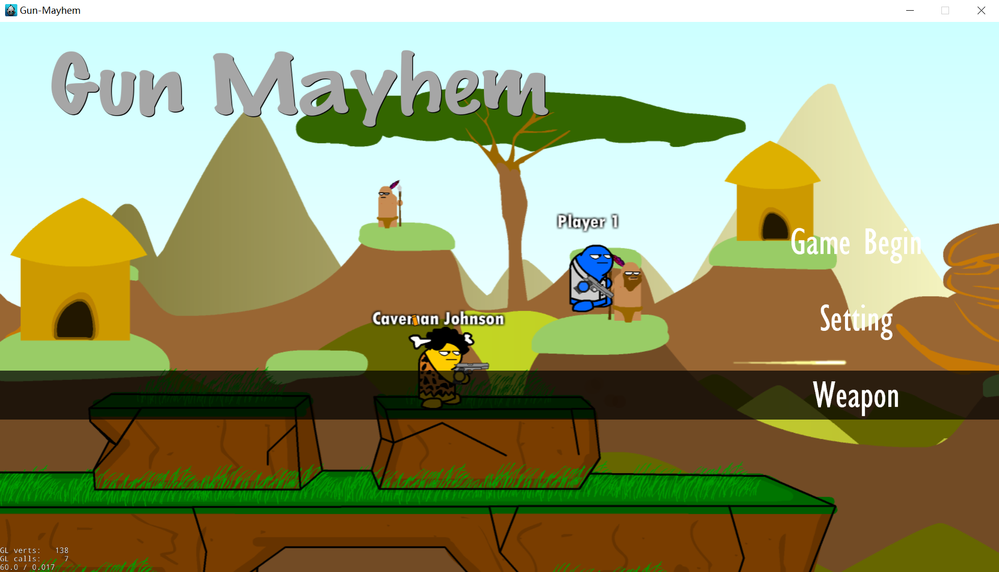


添加菜单项个数的鼠标move监听，在每个监听里设置回调函数。回调函数通过添加精灵，设置淡出效果，设置0.5f的延时，从而实现目录的鼠标move效果。

相当于整个目录分为了两层，一层是menu的菜单项，另一层是三个精灵，由鼠标事件触发调用。

提升点：可以使用透明度更高的图片，效果会更好

### **11.21 对菜单栏的滑条进行优化。**

通过设置精灵的action代替0.5f的淡出效果，实现“鼠标菜单某位置，某位置即做出滑条反应，并稳定出现滑条”，不再出现在设置淡出效果时，若鼠标长时间不动就淡出，在视觉上造成闪退的问题。

### **12.12 start界面背景换为两个AI在sunset的场景。**


实现：将双AI打斗的场景涉及的部分放到底层，在他的上层加菜单栏。

存在问题：直接在init()里切换场景，因为时间过短，handleSceneChange()捕捉不到场景的改变，所以会出现黑屏的情况。引擎源码如下：

```
init()
// do something
handleSceneChange()
```

问题解决：在init()中调用切换场景函数时，添加delay进行延迟，目前在我电脑上，delay最快为1.05f(不同电脑会不同，设为2.0f比较保险)  
delay设置代码如下：

```
auto* delay = DelayTime::create(2.0f);
auto* func = CallFunc::create([this]() {
    // 切换场景
});
this->runAction(Sequence::create(delay, func, nullptr));
```

仍存在问题：切换后会有一段时间的灰屏出现，目前合理推断为程序执行捕捉场景变化函数时的状态，若要解决，可能需要改引擎。  

### **12.15 实现Setting界面。且完成背景音乐和音效的控制。**

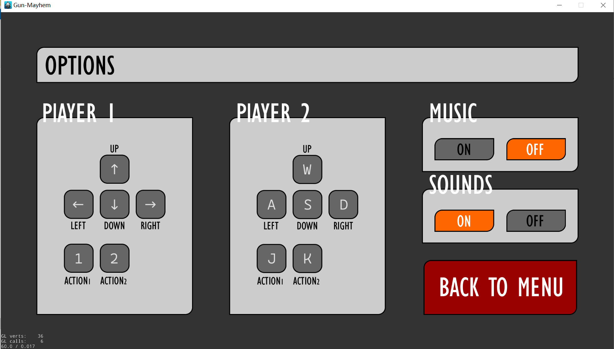

有关背景音乐和音效的控制：在Helloworld类中预加载；在StartScene类内初始化背景音乐；在Setting类内实现对背景音乐的控制。

存在问题：在StartScene类中，如果如下初始化，会导致每回一次StartScene，就叠加一个从头播放的背景音乐，最后导致多层背景音乐叠加。

```
auto backgroundAudioID = AudioEngine::play2d("Music/Start.mp3", true);
```

问题解决：通过isBackgroundMusicPlaying()函数来确认是否目前有音乐，若有，直接stop。这样的效果是每回一次StartScene,都从头播放音乐。

```
if (!instance->isBackgroundMusicPlaying()){}
	else {
		instance->stopBackgroundMusic(); //stop后无法恢复播放
	}
	instance->playBackgroundMusic("Music/Start.mp3", true);
```

### **12.17 实现BackgroundChoise界面。在GameManager类添加全局变量**

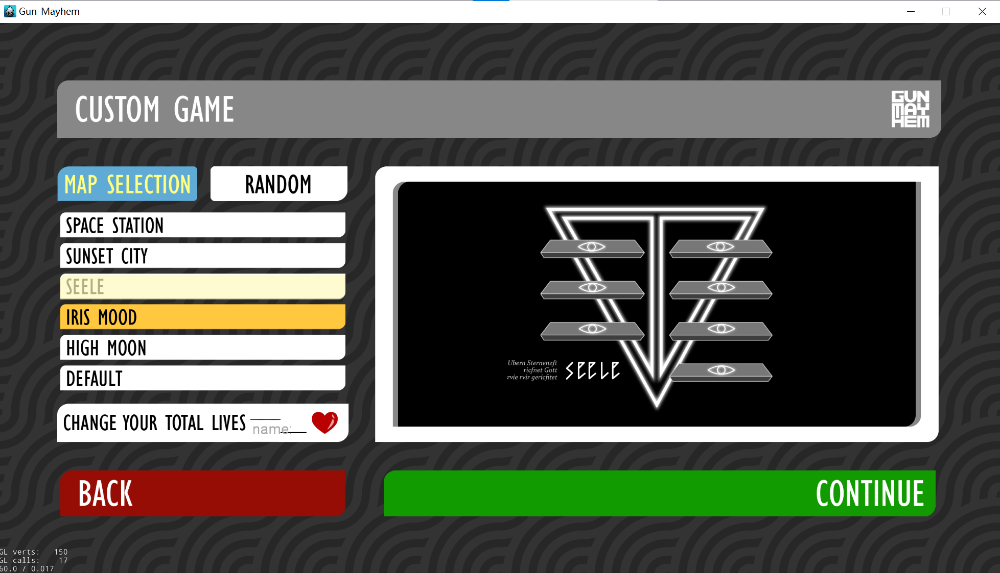
该界面主要是按钮构成。地图选择的部分添加滑动色块的效果。但以图片按钮存在第一个问题就是，点击后会迅速恢复原状态，所以在回调函数中，更改主状态图片；第二个问题是，两张图片位于同一图层，这样在最后选中时，橙色位于滑动色块下层，效果不好，所以在点击回调函数中设置图层变更。

该界面还有一个文本框，用于输入需要的生命数量。

该界面的所有选择信息，都存入GameManager里，为后续游戏准备。

### UI界面设计

### **11.20 实现开机动画、start界面。实现了目录的鼠标move监听。**


添加菜单项个数的鼠标move监听，在每个监听里设置回调函数。回调函数通过添加精灵，设置淡出效果，设置0.5f的延时，从而实现目录的鼠标move效果。

相当于整个目录分为了两层，一层是menu的菜单项，另一层是三个精灵，由鼠标事件触发调用。

提升点：可以使用透明度更高的图片，效果会更好

### **11.21 对菜单栏的滑条进行优化。**

通过设置精灵的action代替0.5f的淡出效果，实现“鼠标菜单某位置，某位置即做出滑条反应，并稳定出现滑条”，不再出现在设置淡出效果时，若鼠标长时间不动就淡出，在视觉上造成闪退的问题。

### **12.12 start界面背景换为两个AI在sunset的场景。**


实现：将双AI打斗的场景涉及的部分放到底层，在他的上层加菜单栏。

存在问题：直接在init()里切换场景，因为时间过短，handleSceneChange()捕捉不到场景的改变，所以会出现黑屏的情况。引擎源码如下：

```
init()
// do something
handleSceneChange()
```

问题解决：在init()中调用切换场景函数时，添加delay进行延迟，目前在我电脑上，delay最快为1.05f(不同电脑会不同，设为2.0f比较保险)  
delay设置代码如下：

```
auto* delay = DelayTime::create(2.0f);
auto* func = CallFunc::create([this]() {
    // 切换场景
});
this->runAction(Sequence::create(delay, func, nullptr));
```

仍存在问题：切换后会有一段时间的灰屏出现，目前合理推断为程序执行捕捉场景变化函数时的状态，若要解决，可能需要改引擎。  

### **12.15 实现Setting界面。且完成背景音乐和音效的控制。**


有关背景音乐和音效的控制：在Helloworld类中预加载；在StartScene类内初始化背景音乐；在Setting类内实现对背景音乐的控制。

存在问题：在StartScene类中，如果如下初始化，会导致每回一次StartScene，就叠加一个从头播放的背景音乐，最后导致多层背景音乐叠加。

```
auto backgroundAudioID = AudioEngine::play2d("Music/Start.mp3", true);
```

问题解决：通过isBackgroundMusicPlaying()函数来确认是否目前有音乐，若有，直接stop。这样的效果是每回一次StartScene,都从头播放音乐。

```
if (!instance->isBackgroundMusicPlaying()){}
	else {
		instance->stopBackgroundMusic(); //stop后无法恢复播放
	}
	instance->playBackgroundMusic("Music/Start.mp3", true);
```

### **12.17 实现BackgroundChoise界面。在GameManager类添加全局变量**


该界面主要是按钮构成。地图选择的部分添加滑动色块的效果。但以图片按钮存在第一个问题就是，点击后会迅速恢复原状态，所以在回调函数中，更改主状态图片；第二个问题是，两张图片位于同一图层，这样在最后选中时，橙色位于滑动色块下层，效果不好，所以在点击回调函数中设置图层变更。

该界面还有一个文本框，用于输入需要的生命数量。

该界面的所有选择信息，都存入GameManager里，为后续游戏准备。

### **1.4 实现PlayerSetup类**

里面按钮都关联全局变量的设置。  

### **1.6 实现排行榜**

排行榜主要是文件读写的部分。同时需要实现一个按map的value[0]排序的算法。  
再就是一些小点。比如说控制小数位数保留，double值转string。
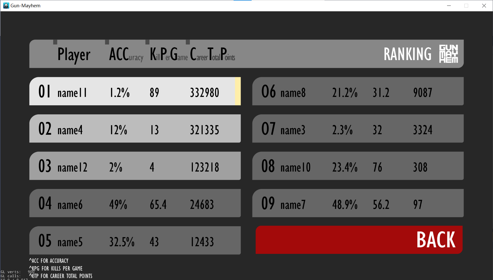


### 人物动画制作

### 11/7

人物身体组件：

为实现人物复杂的动画我将人物分解成不同的组件：头、身体、手、脚、脸。不同的身体组件对应不同的响应动画，并且都继承于 `OrganBase`  类，`OrganBase` 基类中包括精灵 `organ` 存放组件对应的图像， `init()` 函数用于初始化组件;`setFlippedX()`  函数用于翻转组件（Cocos中的翻转函数只支持图片像素上的翻转不支持图片坐标的翻转）；`MoveDelay()` 函数用于动画的延迟（在跳跃过程中脸，手，脚有一定的延迟特效）。

```c++
class OrganBase : public Sprite
{
public:

	bool initWithName(const char* name);

	virtual void setFlippedX(bool flippedX);

	virtual void MoveDelay(bool up, bool floor);

	Sprite* organ;
};
```

Hand/Feet

在类Hand和Feet中`Walk()` 函数用于手脚在移动过程中的动画(手的前后摆臂，脚的前后踏步)

Hand

在类Hand中，RaiseHandToShot()用于开枪时人物的响应，包括手的动画和武器事件，我们将手的动画定义在武器类里面，因为不同的武器使用对应不同的手的动画。 `Shot()` 对应武器事件包括武器的动画和对应响应。类似功能的函数有 `BulletChangeWithHand()` 和 `DelayWithHand()` 一个是用在子弹用完之后主动换枪动作，一个是用在捡到武器之后被动换枪动作。

```c++
void Hand::RaiseHandToShoot(MapBase* map,bool right)
{
    onShot = false;
    actionState = false;
    organ->stopAllActions();
    CallFunc* onshot = CallFunc::create(CC_CALLBACK_0(Hand::SetShot, this));
    auto raise = Gun->RaiseHand(right);
    auto seq_shot = Sequence::create(onshot, raise, onshot, nullptr);
    organ->runAction(seq_shot);//手部动画执行
    if(this->gun)
        this->Gun->Shot(map, right);//枪械动画执行
}
```

身体组件的组合：

每一个身体组件本质上也是精灵，但是组件对应的图像是存放在类成员organ里，组件本身并没有任何图像，所以身体组件的组合需要考虑每一个组件的坐标位置和组件中organ相对于组件的坐标位置。之所以不直接将身体组件图像直接定义在组件类上，而是存放在其中的成员变量中，是因为这样将原本只有一层的图像变换成两层，一层是组件精灵空间，一层是organ精灵，两层的图像在后续人物动作的实现上更为灵活和便捷。


### 11/10

setFlippedX()

翻转函数是整个2d动画中最为关键的一个函数，原引擎中的翻转函数只支持像素层面上的“翻转”，但是人物是由很多个组件组合而成，因此还需要考虑到组件在坐标层面上的翻转。最基本的 `setFlippedX()` 函数，其中_flippedX用于记录精灵的翻转情况，正常情况下没有翻转为false，若精灵翻转则为true

```c++
virtual void setFlippedX(bool flippedX)
{
    organ->setFlippedX(flippedX);//organ的翻转
    if (_flippedX != flippedX)
    {
        _flippedX = flippedX;
        this->setPositionX(-this->getPositionX());//位置的翻转
        flipX();
    }
}
```

  不同的组件还需要考虑其他的一些因素，比如organ被创建在组件上是有相对位移，需要改变organ相对于组件的坐标位置；若organ有旋转角度，翻转之后还需要调整organ的旋转角度。


### 11/14

控制按钮的设计

cocos2dx中键盘的响应事件只有在按下按键的瞬间和弹起按键的瞬间，但需要某些按键在按压状态下的事件响应则需要一个map来存放按键是否处于按下的状态 `std::map<std::string, EventKeyboard::KeyCode> keyMap` 。这样人物只需要根据map中的value值来判断人物的移动了。

```c++
std::map<std::string, EventKeyboard::KeyCode> GameManager::map1 = {
    {"up", EventKeyboard::KeyCode::KEY_UP_ARROW},
    {"down", EventKeyboard::KeyCode::KEY_DOWN_ARROW},
    {"left", EventKeyboard::KeyCode::KEY_LEFT_ARROW},
    {"right", EventKeyboard::KeyCode::KEY_RIGHT_ARROW},
    {"shot", EventKeyboard::KeyCode::KEY_1 },
    {"skill", EventKeyboard::KeyCode::KEY_2 }
};
```

实现人物的左右移动、跳跃和二段跳

人物移动和跳跃的基本逻辑就是改变人物的移动速度，update(float dt)根据人物的瞬时速度改变人物的位置，同时更新人物的属性，更新人物的动作。下面的代码只包括人物在平地上的移动逻辑，不考虑人物移动过程中的动作更新和人物在floor之间的移动和射击逻辑（具体详细的逻辑见源代码）。

```c++
void CharacterBase::update(float dt)//精简版本
{
	Sprite::update(dt);
    //不在空中
    if (!inTheAir) {
        y_speed = 0;isDoubleJump = false;
        //普通跳跃
        if (keyMap["up"]) {
            inTheAir = true;
            y_speed = status->y_maxSpeed;
            keyMap["up"] = false;
            MoveDelay(true, false);
        }
    }
    //在空中
    if (inTheAir) {
        if (y_speed<0)
            MoveDelay(false, false);
		//二段跳判定
        if (!isDoubleJump && keyMap["up"]) {
            MoveDelay(true, false);
            y_speed = status->y_maxSpeed / 1.2;
            isDoubleJump = true;
            keyMap["up"] = false;
        }
    }
    //处在下降过程中
    if (y_speed < 0)
    {
        //落地判定
        if (getPositionY() > floor_base && getPositionY() + y_speed * dt < floor_base) {
            keyMap["down"] = false;inTheAir = false;y_speed = 0;
            this->setPositionY(floor_base);//更新y轴方向上的位置
        }
        else {
            this->setPositionY(getPositionY() + y_speed * dt);//更新y轴方向上的位置
        }
    }
    else
        this->setPositionY(getPositionY() + y_speed * dt);//更新y轴方向上的位置

	//左右移动的判定
    if ((keyMap["left"] ^ keyMap["right"])) {

        if (keyMap["left"]) Flip(true);
        else Flip(false);
        accelerate = keyMap["right"] ? status->acceleration : -status->acceleration;
        x_speed += accelerate * dt;
        if (x_speed * accelerate > 0 && std::abs(x_speed) > status->x_maxSpeed )
            x_speed -= accelerate * dt;
    }
    //若左右按键同时按下或同时松开则为摩擦减速
    else if(! inTheAir) {
        accelerate = x_speed > 0 ? -status->resistance : status->resistance;
        if (std::abs(accelerate * dt) > std::abs(x_speed))
            x_speed = 0;
        else
            x_speed += accelerate * dt;
    }
    this->setPositionX(getPositionX() + x_speed * dt);//更新x轴方向上的位置
}
```


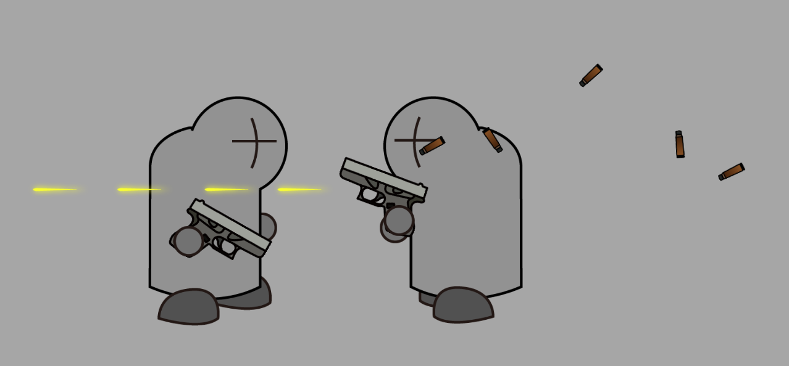

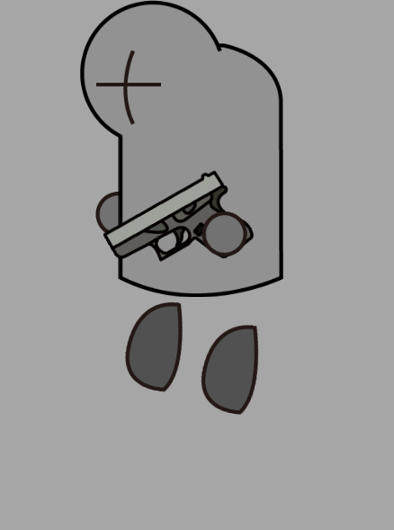

### 11/15

Cocos2d 引擎修改

引擎痛点：引擎中自带的action只能实现固定的轨迹，在动作执行过程中无法改变对象的相对位置（比如在游戏过程中需要翻转，对应的动作不会跟着翻转）。原因是原引擎动画移动的逻辑是先记录动作开始时的状态，然后根据动作计算出需要的改变量（距离或角度），后续的更新根据这两个值来更新对象的状态（位置和角度），问题就出在开始的状态和改变量在动作执行过程中是不发生改变的，在动作周期内对象会依照规划好路线变化，而不会根据人物的翻转情况做出改变。

修改方案：在动作更新时，根据对象是否翻转情况，改变对象的坐标。以 ` MoveBy::create(float t,Vec2 x)` 举例（t为动作周期，x为偏移坐标），原引擎是在动作开始时先得到对象初始的坐标值，然后在每次更新时，根据动作的总偏移量计算出在动作周期内该时刻的偏移量，最后更新对象的位置。而我们需要修改的地方就是这个动作里的初始坐标值和中的偏移量，根据动作对象的翻转情况，实时改变动作的初始坐标值和对应的偏移量。

```c++
void MoveBy::update(float t)//简易版
{
    if (_target)
    {
        Vec2 currentPos = _target->getPosition();
        Vec2 Delta = _positionDelta;//偏移量
        _target->isLeft() ? Delta.x = -_positionDelta.x : Delta.x = _positionDelta.x;//改变偏移量
        Vec2 start = _startPosition;//初始坐标
        _target->isLeft() ^ isLeft ? start.x = -_startPosition.x : start.x = _startPosition.x;//改变偏移坐标
        Vec2 newPos = start + (Delta * t);//更新对象坐标
        _target->setPosition(newPos);
        _previousPosition = newPos;
    }
}
```


### 11/17

人物在floor上的移动：

如果给予floor一定的碰撞体积，则需要在物理层面上定义floor的刚体属性，但这将极大的限制人物的移动空间，人物因此也不能灵活的穿梭在不同的floor之间。所以该游戏将每层地图可移动的范围写进数组中，在人物移动过程中，根据人物的位置利用函数InTheBoundary（）来判断人物是否处在floor所规定的边界内。我们将所有floor的左右边界放入到  `vector<vector<float>>Floor`  中，每个floor之间的高度差一定，我们只需要记录第一层floor的高度，利用高度差和层数来计算其他层floor的高度。

```c++
bool CharacterBase::InTheBoundary(std::vector<float>& floor, float x) const
{
    for (int i = 0; i < floor.size() - 1; i += 2) {
        if (x > floor[i] && x < floor[i + 1])
            return true;
    }
    return false;
}
```


### 11/17

实现人物不同floor之间移动：

人物在不同floor之间移动的基本逻辑是,人物“跳跃‘时 `floor++`  ，人物”下降“时 `floor--`，人物”踩空“时`floor--` , 人物下降在边界外时 `floor--`，这样我们就能确定每一时刻人物对应的floor。

但如果遇到人物没有跳上台阶的情况，我们判断人物在下降过程中，如果穿过该层（不处在该层的边界内）则 `floor--` ，同样也存在人物“踩空”和“下降”跌落之后利用二段跳跳回的情况，在这两会使得 `floor--`  ，但我们不能直接在二段跳之后使层数增加，而是要判定二段跳之后是否上穿上层floor，若上穿则 `floor++` ，若没有则保持不变。我们利用人物与floors之间位置的关系与人物的移动状态来判断人物所处的floor。

后续的ai移动判定会利用到人物的floor值，但如果直接利用上述floor我们不好直接判断人物所处的floor，因为当人物跳跃的瞬间人物 `floor++` ，但实际的层数并没有发生变化。所以我们引进floor_actual进一步判断人物所处层数，只有当人物落地后更新一次floor_actual，这样当人物跳跃和下降瞬间不会马上改变人物的floor，更利于ai的逻辑判断。


### 11/19

镜头的跟随和多层画布相对移动：

我是将人物作为子节点放到platform上，所以实现镜头的移动则为平台以和人物相反的方向移动，达到镜头跟随的效果，但是如果平台移动距离和人物移动距离完全一致就会出现人物完全静止的效果，所以平台实际移动的距离为人物移动距离乘上一个相对系数，后面的画布逻辑一样，移动方向为人物移动方向的反方向，同时移动距离为人物移动距离乘上一个相对系数，由近到远，系数逐渐减少趋近0。

```c++
backLayer->setPosition(initbackLayerPosition - delta * 0.1);
mountain1->setPosition(initMountain1Position - delta * 0.2);
city1->setPosition(initCity1Position - delta * 0.3);
city2->setPosition(initCity2Position - delta * 0.4);
city3->setPosition(initCity3Position - delta * 0.5);
mountain2->setPosition(initMountain2Position - delta * 0.6);
platform->setPosition(initPlatformPosition - delta * 0.7);
```


### 11/20

子弹制作

子弹的创建位于枪械动画中，枪械的动画是由一系列基础动画拼接而成，cocos2dx允许将一个函数作为动作拼接在一系列动画之间。

```c++
CallFunc* setbullet = CallFunc::create(CC_CALLBACK_0(GunBase::SetBullet, this));//子弹的创建
auto aim = RotateTo::create(0, 0);
auto up = RotateTo::create(0.05, -30);
auto down = RotateTo::create(0.05, 0);
auto delay = RotateTo::create(0.9, 0);
auto back = RotateTo::create(0.3, 30);
auto seq_shot = Sequence::create(aim, setbullet, up, down, delay, back, nullptr);
gun_right->runAction(seq_shot);
```

子弹创建时需要传入子弹射出时的位置和射击者本身的指针，射击者指针中存储了其带有的武器的指针，武器中存储了了子弹的射速和伤害量，这样每发子弹在射出后就带上了不同的属性，同时在击中对方之后也可以响应到射击者，实现射击者和子弹之间交互。

```c++
void Gun_Glock::SetBullet()
{
    GunBase::SetBullet();
    BulletCase::create(player, GetPositionToBackground(tue), Vec2(10, 30));
    map->bullets.push_back(Bullet::create(player, GetPositionToBackground(true), Vec2(50, 30)));
}
```

我们将子弹作为基类也可以派生出其他类型的投掷物，例如棒球、小刀、炸弹等等。

弹壳制作

弹壳创建类似于子弹，只不过不需要实现弹壳与人物之间的交互，为了体现弹壳掉落时的随机性，弹壳飞出的初速度和旋转速度都是随机的。

子弹碰撞事件

子弹碰撞事件并没有用到物理引擎，我们是根据子弹的矩形框是否和人物的矩形框重叠来判定子弹的碰撞之间。子弹被创建之后则被加入到处在map类中子弹的动态数组里面，在地图的更新时事实判断子弹和人物之间的碰撞情况，若碰撞发生，则根据子弹带有的属性更新击中者的状态。

```c++
void MapBase::ShotEvent()//简易版本
{
	for (auto& bullet : bullets) {
		for (auto& player : players) {
			auto rect = player->body->organ->getBoundingBox();//计算player的矩形区域
			Vec2 offset = player->getPosition() + player->body->getPosition();
			rect.origin += offset;//矩形区域的位置
            
			if (rect.containsPoint(bullet->getPosition()) && 
                player->valid && bullet->player != nullptr) {

					player->x_speed += player->defense ? 
                        bullet->hitSpeed / 10 : bullet->hitSpeed;//被击中者击退速度

					if(!player->defense) {//血迹的制作
						auto blood = Blood::create();
						blood->setPosition(bullet->getPosition());
						platform->addChild(blood, 4);
					}

					bullet->removeFromParent();
					bullet = nullptr;
					break;
				}
			}
		}
	}
}
```


### 11/21

粒子动画的制作：

本游戏中的粒子动画有：血迹、尘土、喷气背包的火焰等，我们没有利用传统的粒子动画制作软件去制作粒子动画，而是利用随机函数和动画来制作粒子动画效果。

随机函数 `Random`() 输入范围返回随机值

```c++
float GameManager::Random(int min, int max) {
    std::random_device rd;
    std::default_random_engine eng(rd());
    std::uniform_real_distribution<float> distr(min, max);
    return distr(eng);
}
```

尘土动画，将动画划分为三个部分：左右飘动move、向上漂浮move_up和消失shrink，其中飘动和漂浮的距离，消失的时间都是随机的，这样就制造出尘土飞扬的感觉。

```c++
bool Dust::init()
{
	if (!Sprite::init())
		return false;

	for (int i = 0; i< 5;i++)
		Dusts.push_back(Sprite::create("dust.png"));

	for (auto& dust : Dusts) {
		float x = GameManager::Random(-200,200)；
		float y = GameManager::Random(-30, 150);
		float time = GameManager::Random(6, 16) / 10.0f;
		auto move = EaseSineOut::create(MoveBy::create(time, Vec2(x, 0)));
		auto move_up = MoveBy::create(time, Vec2(0, y));
		auto shrink = ScaleBy::create(time, 0);
		auto Dissipate = CallFunc::create([&]() {dissipate++; });
		auto spa = Spawn::create(move,move_up, shrink, nullptr);
		auto seq = Sequence::create(spa, Dissipate, nullptr);
		dust->setScale(GameManager::Random(3, 7)/2.0f);
		dust->setOpacity(GameManager::Random(60, 150));
		dust->setPosition(x/3, 0);
		this->addChild(dust);
		dust->runAction(seq);
	}
	return true;
}
```


### 11/24

换枪/扔枪动作

所有的枪械在子弹耗尽之后需要衔接一个换枪动作，这样才能让武器的切换在观感上显得流畅，我们的想法是在子弹耗尽之后将枪扔出，再换成要切换的枪。换枪的逻辑就是在子弹用完之后，将人物里的成员变量gun换成要切换的枪，问题在于换枪动画放在哪里，如果按照基本的逻辑是子弹用尽之后赋予这把枪一个被扔出去的动画，但是当子弹耗尽之后会立马切换到另外一把枪同时释放到之前那把枪的指针，这样再前一把枪还没有被扔出去前就已经被释放掉，动画也会随之一起被释放，不会有一把枪被人出去的效果。所以我们的做法是再前一把枪被扔出去前先将这把枪的图像传入到下一把枪中，这样再执行下一把枪的动画前先执行前一把枪被仍出去的效果，这样就解决了前一把枪还没被扔出就已经被释放的问题。 `BulletChangeWithHand()` 里面包含了换枪后人物手部的动画和枪的动画。

```c++
 if (gun->bulletCount >= gun->bulletClip && gun->deltatime > gun->shotInterval) {
            throwGun = gun->clone();//前一把枪的图像
            GunChange(initGun);//执行换枪
            hand1->BulletChangeWithHand(throwGun, true);
            hand2->BulletChangeWithHand(throwGun, false);
 }
```

```c++
void Hand::BulletChangeWithHand(GunBase* throwgun,bool right)
{
    onShot = false;
    organ->stopAllActions();
    CallFunc* onchange = CallFunc::create([&]() {onShot = !onShot; });
    auto bulletchange = throwgun->BulletChange(right);
    auto seq_change = Sequence::create(onchange,bulletchange,onchange, nullptr);
    organ->runAction(seq_change);

    this->Gun->Change(throwgun, right);
}
```

捡枪动作

人物捡枪的动作相比人物扔枪的动作要简单，其基本逻辑就是将人物原有的枪换成捡到的枪，但遇到问题时再上一把枪还在执行动画的过程中如果捡到枪，人物手的动作还停留再上一把枪的姿势中，而且如果人物手的姿势不是处在初始化的状态，执行下一把枪的动做时会出现bug，所以为了连贯的衔接捡到枪的动画，我们又在Hand类里面定义了 `DelayWithHand()` 用于衔接捡到枪之后的动画，如果上一把枪处在瞄准的姿势，则捡到枪之后手和枪的姿势先停留一段时间再放下，这样就能是的动作连贯流畅。

```c++
void Hand::DelayWithHand(bool right)
{
    onShot = false;
    organ->stopAllActions();
    CallFunc* onshot = CallFunc::create(CC_CALLBACK_0(Hand::SetShot, this));
    auto raise = Gun->HoldingOn(right);
    auto seq_shot = Sequence::create(onshot, raise, onshot, nullptr);
    organ->runAction(seq_shot);
    if (this->gun)
        this->Gun->Delay(right);
}
```

ps：说一下遇到的坑，一是因为要换回到手枪，所以我一开始在人物里面定义了一个 `initGun` 对象存储一开始的枪，然后 `init` 的时候给这个 `initGun` 赋值，之后如果要换枪的时候直接换回这个枪就可以了，但是后面发现不能直接赋值（因为直接赋值，赋过去的是一个指针），所以我在枪类里面写了一个 `clone` 函数，生成一个和原枪类型一样的对象，但即使这些操作都没有问题，我发现后面还是报错，原来是 `cocos2dx` 默认的 `create` 函数会让对象自动释放，如果一开始给 `initGun` 赋值放到人物类里面如果不把这把枪“用”起来（画在下一帧的画面上），系统就会自动释放 `initGun` 里面的内容

### 11/26

GunPackage/SkillPackage

因为游戏中需要人物去捡包来更换枪械和技能，所以创建了 `GunPackage` 和 `SkillPackage` 两个类，这两个类都继承于 `PackageBase` 类，每个子类都一个 `updatetime` 的静态变量，记录包的更新时间。 `PackageBase ` 继承于 `Sprite` 类，里面几个重要函数： `init()` 用于初始化包；`GetPackage(CharacterBase*) ` 用于相应人物捡到包的事件，人物捡到枪和捡到技能具体的逻辑不同；`update()` 更新包的位置。

 `GunPackage` 类中 `GetPackage(CharacterBase*)` 较为简单，只需要调用人物的 `GunChange(GunChange *)` 并传入 `GunPackage` 中存放的要替换的枪即可。

```c++
void GunPackage::GetPackage(CharacterBase* player)
{
    player->GunChange(gun->clone());
}
```


 `SkillPackage` 类中 `GetPackage(CharacterBase*)` 原来的思路是先在 `SkillPackage` 中先初始化一个 `skill` 对象，再将 `skill` 传入到人物里，但是这样会出现一个情况就是当人物捡到包之后，该包对应的指针会直接被释放掉，这样包中对应的skill也会跟着一起被释放掉， `GunPackage` 不会出现这种情况是因为，传入的枪并不是 `GunPackage` 中的枪本身而是该枪的克隆  `gun->clone()`  （这个函数是之前写换枪动作的时候写的）。所以 `SkillPackage` 的初始化不能直接先初始化一个 `skill` 对象，而是先用枚举类 `SkillType` 记录要传递的技能，再在 `GetPackage` 时初始化这个技能。


PackageEvent

PackageEvent类中封装了所有的包事件，只需要在游戏开始是调用他的初始化函数和在游戏更新过程中调用他的更新函数，使用这两个接口函数就能较好的管理包事件。

```c++
class PackageEvent
{
public:
	
	static PackageEvent* create(MapBase* map);

	bool init(MapBase* map);//初始化函数

	void PackageUpdate(std::vector<CharacterBase*>&players);//更新包是否被捡到

	void update(float dt);//更新包掉落的位置

	float gunUpdateTime;//枪包更新的时间

	float skillUpdateTime;//技能包更新的时间

	MapBase* map;

	std::vector<PackageBase*> packages;//包的动态数组
};
```


### 11/28

skill

人物技能的逻辑是，在技能持续时间内改变人物的一些属性（人物的属性包括最大的速度，加速度等，都存放在status这个结构体里面），在技能持续时间结束后恢复这些改变过的属性。skill最关键的两点就是构造函数、析构函数和更新函数。在构造函数中我们根据具体的技能改变人物的属性比如位移速度、加速度和血量等，某些技能在析构函数中还需要恢复人物原有的属性。update()函数依据技能特点更新人物的状态，同时更新相应的特效。skill的逻辑判断放在ChararcterBase类update()函数的最后，这样做的目的是skill所做出的更新改变不会被人物类原有的逻辑判断所覆盖。

```c++
if (!skills.empty()) {
    for(auto& skill: skills) {
        if (skill->skillEnd) {
            delete skill;
            skill = nullptr;
        }
        else {
            skill->update(dt);
        }
    }
    for (auto it = skills.begin(); it != skills.end();) {
        if (*it == nullptr) it = skills.erase(it);
        else it++;
    }
}
```


### 12/1

SpeedUp：快速位移

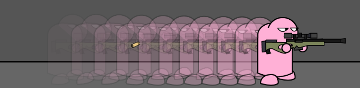

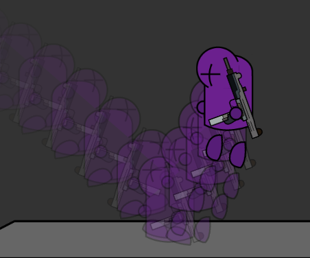

这个技能除了能加快人物的移动速度和加速度之外的一大亮点就是残影的特效。我用一个链表结构来存储每个残影

```c++
struct Shadow {
	Sprite* figure;
	Vec2 point;
	Shadow* next;
	Shadow* last;
	
	Shadow(Sprite* figure,Vec2 point, Shadow* last) {
		this->figure = figure;
		this->point = point;
		this->last = last;
		this->next = nullptr;
	}
};
```

其中的每一个残影存储了位置信息和相应的图像，并存有指向上一个残影的指针和指向下一个残影的指针。首先设置残影的最大数量和更新时间，并用 `head` 和 `tail` 分别存储残影列表的头尾指针。每一次更新，先将 `head` 指针指向的残影绘制到画布上，然后创建一个新的指针，并传入当前人物的位置和对应的图像，同时移动 `head` 指针的位置。如果残影的数量达到最大值，还需要释放 `tail` 指针，对应的残影也会从画布上被移除，最后将 `tail` 指针前移。

有一点需要特别注意，就是每次创建指针不能直接传入当前人物对应的指针，一是该指针会发生变化，残影的内容得不到记录，二是直接对残影指针的操作会影响到人物本身（如果传进去的是人物本身的指针），会出现各种错误，所以我的做法是在 `CharacterBase` 类中定义一个 `clone()` 函数该函数根据人物的各个部件的实时的状态返回一个新的图像。

### 12/10

Jetpack:喷气背包

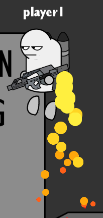

喷气背包的基本逻辑就是在 `update()` 函数中改变人物的纵向加速度，使人物在跳跃于空中时持续按下向上键可以向上飞跃，同时在飞跃过程中制造喷气的粒子动画，实现人物喷气向上的特效。

```c++
void Jetpack::update(float dt)
{
	SkillBase::update(dt);

	if (player->keyMap["up"] == true && player->inTheAir && player->isDoubleJump  && flyable) {
		if (onAction)
			player->MoveDelay(true, false);
		onAction = false;
		player->status->gravitation = anti_gravitation;
		if (player->y_speed > player->status->y_maxSpeed/1.2)
			player->y_speed -= player->status->gravitation * dt;

		Emission();
	}
	else {
		player->status->gravitation = gravitation;
		onAction = true;
	}

	if (jetpack->isFlippedX() != player->isFlippedX()) {
		jetpack->setFlippedX(player->isFlippedX());
		jetpack->setPositionX(-jetpack->getPositionX());
	}
}
```

### 1/3

DoubleTeam:分身

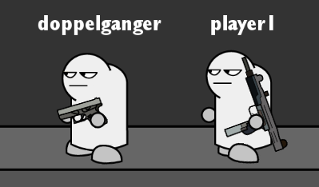

分身的基本逻辑是当在技能的构造函数中创建一个ai，并且将ai的初始位置创建在和人物一样的位置，但是在创建之后还要响应的调整分身的一些参数。

```c++
DoubleTeam::DoubleTeam(CharacterBase* player)
{
	skillTpye = DOUBLE_TEAM;
	this->player = player;
	duration = 0;
	Duration = 10;
	doppelganger = AI2::create(player->getTag(), player->map);//创建分身
    //调整ai的参数
	doppelganger->isDoppelganger = true;
	doppelganger->firstLand = false;
	doppelganger->playerName->setString("doppelganger");
	doppelganger->Live = 1;
	doppelganger->isDoubleJump = player->isDoubleJump;
	doppelganger->inTheAir = player->inTheAir;
	doppelganger->floor = player->floor;
	doppelganger->floor_actual = player->floor_actual;
	doppelganger->Flip(player->isFlippedX());
	doppelganger->GetOpponent(player->opponent);
	doppelganger->setPosition(player->getPosition());
    
	player->map->platform->addChild(doppelganger);
}
```

