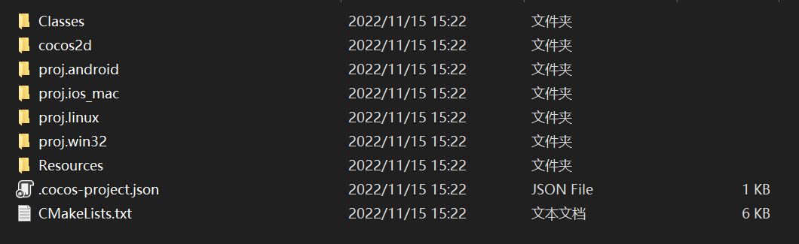
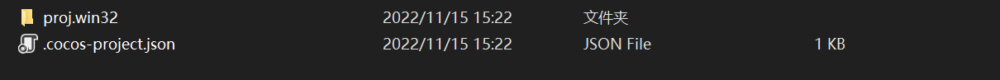
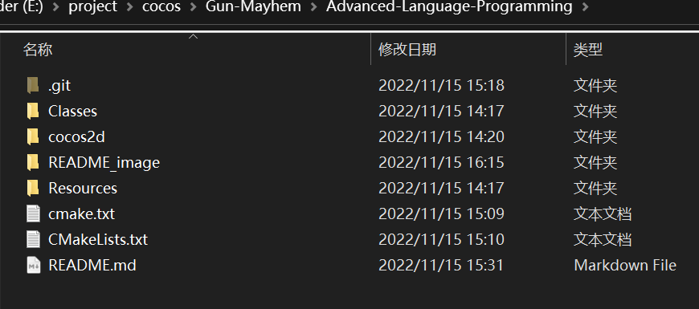

## Setup

1. 环境依赖：

   

   - 下载开发引擎：Cocos2d-x 4.0: https://www.cocos.com/cocos2dx-download

   - python2.7（用于编译Cocos2d-x，python3会报警告）：https://www.python.org/downloads/release/python-2718/

   - cmake (用于编译项目）：https://cmake.org/download/#latest

   - git （用于从github下载仓库的代码）

   - Visual Studio 2022 (IDE)

     

2. 新建一个项目:

   

   

   删除掉不需要的文件，留下两个文件`proj.win32`和`.cocos-project.json`

   

   

3. 克隆仓库：

   在这个路径下打开`git Bash`  输入指令  `git clone https://github.com/Randonee1/Advanced-Language-Programming.git` 将远端仓库中的内容下载到本地，会生成 `Advanced-Language-Programming` 文件夹，里面的文件都被 `git`  管理

   

   将 `Advanced-Language-Programming` 中的  `cmake.txt`  (cmake 指令如果时vs2019要改一下)和  `CMakeLists.txt` 文件复制到项目文件路径下

   

4. 构建项目：

   在项目文件 `proj.win32`  路径下进入 `cmd` ，输入 `cmake` 指令，指令在仓库中的 `cmake.txt` 文件中，生成解决方案 `sln`

   

   